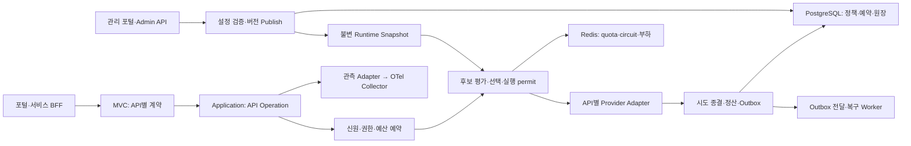

# 전사 공용 LLM Gateway 제품 방향과 재구성 설계

분석일: 2026-09-09. 현재 구현 기준: `ffbd6c7bffb39d28abef2c4669958319cfbc2fe5`.
조사 깊이: deep. 출력: 구현에 착수할 수 있는 설계·마이그레이션 방안 및 인수 조건.
핵심 질문: 내부 포털과 서비스 BFF가 공급자·라우팅·과금 구현을 몰라도 LLM을 안전하게 호출하도록 중개하는 전사 미디에이터 계층을 어떻게 완성할 것인가?

이 문서의 목표 구조와 알고리즘은 **RECOMMENDATION**이다. §2는 현재 소스의 **FACT**와 영향 추론을 구분하고, §6·§12의 표준 동작은 공식 자료를 연결한다. 실행 결과가 필요한 항목은 **UNKNOWN**이다. 구현 완료나 운영 인증을 의미하지 않는다. 외부 구현에서 얻은 설계 원리는 기능 용어로 서술하고 제품 비교 표현은 사용하지 않는다.

## 1. 제품의 책임과 사용 경험

제품의 목적은 **다수의 내부 서비스와 모델 공급자 사이에서 계약·권한·라우팅·실패 처리·예산·관측을 일관되게 적용하는 전사 공용 미디에이터(Mediator) 계층**이다. BFF는 업무 로직을 소유하고 Gateway는 모델 호출과 실행 정책을 중개한다.

| 사용자 | 제공할 경험 | Gateway 책임 |
| --- | --- | --- |
| 포털/BFF 개발자 | 발급된 서비스 키와 논리 모델로 호출 | 인증, 권한, 모델 선택, deadline, 결과·오류 계약 |
| 검색 서비스 개발자 | Embeddings와 Rerank를 개별 API로 사용 | 벡터 호환성, 순서 보존, 제한·사용량 집계 |
| 서비스 책임자 | 프로젝트 예산과 지출·실패 원인 조회 | 프로젝트 범위 권한, 원장 기반 사용량, 비용 확정 상태 |
| 플랫폼 운영자 | 모델 설정 검증·배포·복구, 키 폐기, 장애 분석 | 관리 API, 변경 감사, 적용 버전, 안전한 롤백 |

제품 범위는 기존 Chat Completions에 Embeddings, Rerank, Responses를 추가하고, adaptive/quota-aware routing, least-busy/lowest-cost, 사용량·예산 제어, 내구성 있는 비용 기록, OTel, Virtual Key 및 Admin Surface를 완성하는 것이다. Images는 별도 요구가 확정될 때 검토하는 선택 API이며 미디에이터 역할에서 도출되는 필수 범위가 아니다.

용어 정정: 앞선 “미디어시스템”은 “미디에이터시스템”을 의미한다. 이미지 생성·전달, 객체 저장소, CDN, 자산 보관 및 미디어 작업 관리 책임을 뜻하지 않는다. 그 오해에서 파생된 저장·전달·job 설계와 필수 출시 조건은 제거한다. 여기서 Mediator는 시스템의 중개 역할이며 특정 라이브러리나 범용 command bus 도입을 요구하지 않는다.

클라이언트는 `model`에 업무별 논리 모델을 보낸다. 예: `portal-assistant`, `search-embedding-v1`, `search-reranker`. 정책명·fallback chain·provider ID·예산 ID를 요청에 넣지 않는다. 업무 품질·지역·보안 요구는 관리자가 논리 모델과 프로젝트 정책에 연결한다. 전사 신원은 키로 도출하며 임의 `tenant` 헤더를 신뢰하지 않는다.

기존 제한을 유지한다: Kotlin, Spring MVC, JDK 21 virtual threads, PostgreSQL/Redis 필수, OpenAI/AWS Bedrock/OpenRouter. 클래스당 파일 하나, `*QueryIn`/`*CommandIn`, 프레임워크 없는 core/domain/application을 유지한다. 외부 SDK가 내부적으로 사용하는 반응형 타입은 adapter 밖으로 노출하지 않는다.

### 1.1 채택·격리·비채택 기준

선택 기준은 기능 수가 아니라 소비자 계약의 안정성, 금전·권한의 정확성, 장애 영향 범위, 운영 비용이다. 아래는 목표 설계이며 현재 지원 기능 목록이 아니다.

| 구분 | 선택 | 소유 경계와 이유 |
| --- | --- | --- |
| 유지·강화 | 논리 모델, typed API, bounded execution, 공개 provider 비노출 | BFF는 업무 API만 사용하고 execution operator가 정책을 소유 |
| 공통 필수 | 권한·capability·quota eligibility, 예산 예약, 원장, 변경 감사 | 모든 유료 operation에 동일하게 적용; 플러그인으로 우회하지 않음 |
| 선택형 전략 | weighted rendezvous / least-busy / lowest-cost / adaptive | 정책별 ranking 하나만 선택; 모든 전략을 중첩하거나 별도 외부 평가 호출을 추가하지 않음 |
| 격리 | stored Responses | capability별 opt-in; 상태 보관 장애를 stateless 호출과 분리 |
| 격리 | 관리 명령, 사용량 조회, 분석, 관측 export | 관리 신원과 BFF 조회 권한 분리; 분석·export 장애는 금전 원장 쓰기와 구별 |
| 단계적 확대 | 프로젝트 소유 cell, 예산 사전 배분 | 대량 트래픽의 공유 잠금·장애 전파를 줄임. 단일 cell부터 시작하며 §12의 조건으로 물리 분리 |
| 비채택 | 임의 routing header, graph DSL, 품질 평가용 LLM, 자체 미디어 플랫폼 | 현재 공용 중개 목적에 비해 소비자 결합·운영 비용 증가; 명확한 별도 요구 전까지 추가하지 않음 |

guardrail은 입력 크기·권한·정책 검사와 출력 검사를 기존 port 경계에서 유지한다. 별도 외부 검사기를 활성화할 때만 해당 profile에 deadline·동시성·실패 정책을 둔다. 필수 보안 정책의 검사 불능은 fail-closed이며, streaming 공개 이전 검사 범위와 공개 이후 차단 한계를 계약에 명시한다. 검사기 장애를 모델 장애로 집계하거나 원문을 무조건 외부에 전송하지 않는다.

## 2. 현재 구현에서 먼저 교정할 지점

다음은 정적 소스 검토 결과다. 테스트를 새로 실행하거나 실제 장애를 재현했다는 의미는 아니다.

| ID | FACT: 현재 구조 | INFERENCE: 확장 시 영향 | 변경 지점 |
| --- | --- | --- | --- |
| L1 | `ProviderInvokerPort`가 `CanonicalChatRequest`, 텍스트 응답과 chunk만 받음 | 다른 API를 Chat으로 변환하면 의미·사용량·오류가 소실됨 | [ProviderInvokerPort](../../llm-gateway-application/src/main/kotlin/com/example/llmgateway/application/port/out/ProviderInvokerPort.kt) |
| L2 | planner가 모든 후보에 `circuitBreaker.allow()` 호출; Redis `allow`는 half-open probe를 점유함 | 선택되지 않은 후보도 probe를 점유할 수 있음. 단순 조회와 permit 획득 분리 필요 | [planner](../../llm-gateway-application/src/main/kotlin/com/example/llmgateway/application/service/WeightedRendezvousRoutePlanner.kt), [Redis circuit](../../llm-gateway-adapters/src/main/kotlin/com/example/llmgateway/adapter/out/redis/RedisCircuitBreakerAdapter.kt) |
| L3 | registry `initialize()`가 각 인스턴스의 설정을 upsert하고 로컬에 없는 deployment를 disable함. priority도 upsert 대상 | 서로 다른 설정으로 rolling deploy하면 전사 설정과 충돌 가능. 현재 runtime override의 영속성만으로 설정 생명주기를 보장할 수 없음 | [registry](../../llm-gateway-adapters/src/main/kotlin/com/example/llmgateway/adapter/out/postgres/PostgresDeploymentRegistryAdapter.kt) |
| L4 | controller가 caller의 `X-Request-Id`를 내부 ID로 사용; 원장 request PK와 observation map도 해당 ID 사용 | 재사용·동시 요청·다른 프로젝트의 같은 ID가 원장과 관측을 섞을 수 있음 | [controller](../../llm-gateway-app/src/main/kotlin/com/example/llmgateway/adapter/in/web/ChatCompletionController.kt), [request 원장](../../llm-gateway-adapters/src/main/kotlin/com/example/llmgateway/adapter/out/postgres/PostgresRequestAccountingAdapter.kt), [observer](../../llm-gateway-adapters/src/main/kotlin/com/example/llmgateway/adapter/out/observability/MicrometerRequestObserver.kt) |
| L5 | request accounting과 attempt accounting 예외를 `runCatching`으로 소거 | PostgreSQL 저장 실패 후 복구할 durable event가 남지 않을 수 있음 | [request lifecycle](../../llm-gateway-application/src/main/kotlin/com/example/llmgateway/application/operator/RequestLifecycleOperator.kt), [attempt](../../llm-gateway-application/src/main/kotlin/com/example/llmgateway/application/operator/DefaultCompleteAttemptOperator.kt) |
| L6 | request 원장이 `attempt_sequence > 1`을 fallback 수로 집계 | 같은 deployment 재시도도 fallback으로 집계됨 | [request 원장](../../llm-gateway-adapters/src/main/kotlin/com/example/llmgateway/adapter/out/postgres/PostgresRequestAccountingAdapter.kt) |
| L7 | rate limiter는 요청당 1 token을 차감; tenant/caller/model group별 bucket | 공급자 공유 계정 quota, output token, 프로젝트 예산을 제어하지 못함 | [rate limiter](../../llm-gateway-adapters/src/main/kotlin/com/example/llmgateway/adapter/out/redis/RedisTokenBucketRateLimiter.kt) |
| L8 | `Deployment`에 가격 필드와 legacy cost 계산 경로가 남아 있음 | 버전 가격과 중복된 source of truth, 비텍스트 단위 확장 부담 | [Deployment](../../llm-gateway-domain/src/main/kotlin/com/example/llmgateway/domain/routing/Deployment.kt) |
| L9 | controller는 traceparent 문자열에서 trace ID를 추출; observer 시작/종료는 별도 map 관리 | 실제 OTel parent 및 virtual thread context 전파는 별도 검증 필요 | [controller](../../llm-gateway-app/src/main/kotlin/com/example/llmgateway/adapter/in/web/ChatCompletionController.kt), [observer](../../llm-gateway-adapters/src/main/kotlin/com/example/llmgateway/adapter/out/observability/MicrometerRequestObserver.kt) |
| L10 | registry `snapshot()`가 transaction마다 version과 전체 deployment를 조회; planner가 후보마다 circuit 호출 | deployment 수에 따른 DB·Redis 작업 증폭 가능; 측정된 처리량 한계는 아님 | [registry](../../llm-gateway-adapters/src/main/kotlin/com/example/llmgateway/adapter/out/postgres/PostgresDeploymentRegistryAdapter.kt), [planner](../../llm-gateway-application/src/main/kotlin/com/example/llmgateway/application/service/WeightedRendezvousRoutePlanner.kt) |
| L11 | controller 메서드의 인증 전에 `@RequestBody` 변환이 필요하며 SSE마다 virtual thread 생성; admission operator는 rate/guardrail 검사 | 이 경로의 요청 byte·서비스별 동시성·대기열 제한을 별도 검증해야 함; virtual thread만으로 과부하 격리 안 됨 | [controller](../../llm-gateway-app/src/main/kotlin/com/example/llmgateway/adapter/in/web/ChatCompletionController.kt), [admission](../../llm-gateway-application/src/main/kotlin/com/example/llmgateway/application/operator/DefaultRequestAdmissionOperator.kt) |

현재 weighted rendezvous, bounded retry, 공개 provider 비노출, 가격 snapshot, Kotest/Konsist 경계는 재사용한다. 위 경계와 저장 실패 동작을 교정하기 전에는 범용적인 Production-ready 판정을 하지 않는다. 외부 문서의 알고리즘 명칭이나 테스트 파일의 존재도 분산 안정성의 증명으로 취급하지 않는다.

## 3. 목표 계층과 소유권



| 모듈 | 목표 책임 | 주요 변화 |
| --- | --- | --- |
| `llm-gateway-core` | ID, Money, 시간·단위 primitive | ExecutionId, AttemptId, ProjectId; BigDecimal 기반 USD |
| `llm-gateway-domain` | 타입별 추론 모델, 정책·예약 상태·비용 규칙 | `inference/{chat,embedding,rerank,response}`, `routing`, `accounting`, `identity`, `policy` 패키지 |
| `llm-gateway-application` | In/Out Port, Service, Operation, Operator | API별 operation과 공통 admission/attempt/settlement 분리 |
| `llm-gateway-contract` | 공개 DTO/OpenAPI | 네 추론 API의 개별 schema. HTTP DTO를 domain으로 역참조하지 않음 |
| `llm-gateway-adapters` | provider·PG·Redis·OTel·secret 구현 | API별 provider adapter, reservation/ledger, snapshot loader |
| `llm-gateway-app` | MVC data plane·composition root | 기존 실행물 유지, client traffic 경로 |
| `llm-gateway-admin-contract` (신규) | 관리 DTO/OpenAPI | Admin Surface 구현 시 추가; 공개 계약과 별도 문서·권한 |
| `llm-gateway-admin-app` (신규) | 관리 API·composition root | 별도 내부 listener와 배포, client 키로 접근 불가 |
| `llm-gateway-worker-app` (신규) | outbox/reconciliation/집계 스케줄 | durable worker 구현 시 추가, 요청 executor와 pool 분리 |

새 모듈은 각 기능 구현 단계에서 추가한다. domain/application을 API 수만큼 Gradle 모듈로 늘리지 않는다. 헥사고날 바깥 경계는 port로 유지하되 순수 계산 클래스마다 동일한 interface/Default 구현 쌍을 만들지 않는다. 공통 실행 프레임워크의 `Map<String, Any>`나 중앙 API 종류 switch 대신 API별 typed operation이 공통 operator를 조합한다.

```text
HTTP DTO → RequestMapper → *CommandIn → Application Service → API Operation
  → AdmissionOperator → RouteSelectionOperator → AttemptExecutionOperator
  → SettlementOperator → HTTP ResponseMapper
```

과금되는 추론은 HTTP 메서드와 무관하게 `*CommandIn`으로 정의한다. 기존 `ChatCompletionQueryIn.complete`는 새 `CompleteChatCommandIn`으로 이전하고 조회 In Port는 catalog·usage·admin 조회에만 사용한다. HTTP 경로는 그대로 유지한다.

| 인터페이스 (예시 서명, 각 선언 별도 파일) | 계약·불변식 |
| --- | --- |
| `EmbedCommandIn.execute(EmbeddingRequest, ExecutionContext): EmbeddingResult` | index·dimension 보존, batch 결과 원자적 공개 |
| `RerankCommandIn.execute(RerankRequest, ExecutionContext): RerankResult` | 입력 문서의 안정적인 index 반환 |
| `CreateResponseCommandIn.execute(ResponseRequest, ExecutionContext): ResponseResult` | Responses 고유 item·status 모델 |
| `StreamResponseCommandIn.execute(...): ResponseStream` | typed event + 명시적 close/cancel 소유권 |
| `EmbeddingProviderPort`, `RerankProviderPort`, `ResponsesProviderPort` | SDK 타입 비노출; 각 API request/result 유지 |
| `RoutingSnapshotPort.current(): RuntimeSnapshot` | 불변 view, 요청 중 버전 고정 |
| `BudgetReservationPort.reserve(...): ReservationDecision` | 소유 PG에서 배분된 예산·서비스 한도와 attempt 준비를 원자 처리; 전사 배분은 §6 |
| `RuntimeCapacityPort.inspect(...)/acquire(...)/release(...)` | inspect는 읽기 전용; permit에 owner·fencing·expiry |
| `AttemptJournalPort.prepare(...)/complete(...)` | 시도 상태 CAS, 정산·event 생성 transaction |
| `UsageQueryIn`, `RequestUsageQueryIn` | 프로젝트 권한과 공개 비용 projection만 반환 |
| `VirtualKeyCommandIn`, `PolicyPublicationCommandIn` | 관리 신원·낙관적 잠금·감사 강제 |

운영 pool은 HTTP/stream, provider connection, PostgreSQL, worker마다 bounded로 설정한다. virtual thread는 무제한 provider 동시 실행 권한이 아니다. stream은 `Sequence`만 반환해 수명 관리를 소비자에게 암묵적으로 맡기지 않고 `AutoCloseable` handle로 cancel/permit release/정산을 한 번만 수행하게 한다. domain은 Java/Kotlin 표준 타입만 사용한다.

## 4. API 지원과 계약 경계

### 4.1 공개 표면

| API | 필수 계약 | 오류·제한 및 상태 |
| --- | --- | --- |
| `POST /v1/chat/completions` | 기존 JSON/SSE 계약 유지 | 기존 소비자 회귀 방지 |
| `POST /v1/embeddings` | `model`, `input: string|string[]`, 선택 `dimensions`, `encoding_format`; `data[index, embedding]` | 빈 입력·초과 batch·차원 불일치 400. float/base64 검증; token ID 입력은 해당 profile 지원 시만 |
| `POST /v1/rerank` | `model`, `query`, `documents: string[]`, `top_n`; `results[index,relevance_score]` | OpenAI 표준 API로 부르지 않음. 유한 점수·범위·중복 index 검증, 동점은 원본 index 순 |
| `POST /v1/responses` | `model`, typed `input`, `instructions`, output 한도, tools, stream, store | JSON의 output item·status·usage 및 고유 SSE lifecycle 유지 |
| `GET /v1/models` | 인증 주체에 허용된 논리 모델 ID | provider ID·전체 topology·가격·내부 capability 필드 노출 금지 |

일반적인 성공 envelope를 추가하지 않는다. API 고유 성공 형식을 유지하고 비스트리밍 오류만 공통 error로 정규화한다. OpenAPI 3.x schema와 JSON/SSE example, SDK fixture를 함께 유지한다. 현재 3.0.3에서 `oneOf`와 명시적 discriminator로 typed input/event를 표현하고 문서 변경을 validation gate로 검사한다.

소비자 예제에는 BFF SDK의 생성 요청 자동 retry를 끄고 Gateway가 실행 retry를 소유하도록 명시한다. HTTP status만으로 재시도하는 SDK는 `retryable=false`나 `OUTCOME_UNKNOWN`을 해석하지 않을 수 있다. Responses의 stream 재연결은 새 생성 호출로 간주하지 않는다. client timeout은 Gateway deadline보다 길게 두되 남은 업무 deadline과 취소를 전파한다. Java/Spring BFF와 기존 Python/FastAPI 테스트 앱 모두 이 정책을 계약 테스트로 확인한다.

`CapabilityProfile`은 operation, model revision, input/output modalities, option constraints, context/output limit, streaming, tool schema 지원, 지역·데이터 정책을 담는다. publish 시 provider adapter의 실제 지원 범위와 교차 검증한다. capability를 마케팅 catalog로 추정하거나 unsupported parameter를 조용히 삭제하지 않는다.

### 4.2 Embeddings와 Rerank의 정확성

`embeddingSpaceId`는 모델 revision·전처리·normalization·dimension을 포함한 호환성 식별자다. 같은 차원이라도 다른 모델의 embedding으로 fallback하면 기존 index와 query 공간이 달라진다. 하나의 논리 embedding 모델은 같은 space를 보장하는 deployment에만 연결한다. 모델 변경은 새 논리 버전과 소비자 reindex 절차로 진행한다.

batch를 provider 단건 호출로 분해해야 하면 child attempt마다 quota·비용을 기록한다. 반환은 원본 index 순서로 조립하고 하나라도 실패하면 부분 벡터를 성공 응답으로 반환하지 않는다. 최대 batch/총 입력 길이/동시 분할 수를 profile로 제한한다.

Rerank는 검색 결과를 받아 재정렬하는 범위다. 문서 검색·벡터 DB·RAG workflow는 검색 서비스가 소유한다. provider별 relevance score는 확률로 해석하지 않고, fallback도 같은 query/document 입력 전체에 적용한다. 비용 단위는 token이라고 가정하지 않고 query·document block 등의 provider 과금 단위를 보존한다.

### 4.3 선택 API와 범위 경계

Images 지원 여부는 별도 소비자 요구로 결정한다. 현재 필수 OpenAPI·모듈·출시 gate에 이미지 전용 endpoint, port, artifact 저장소, replay 또는 job lifecycle을 추가하지 않는다. 요구가 확정되면 API별 typed adapter와 공통 권한·예산·실행 정책을 재사용하되 저장·전달 책임을 자동으로 Gateway에 부여하지 않는다. 기존 A29–A31/A61은 오해에서 파생된 인수 조건이므로 철회하고 ID만 변경 이력으로 남긴다.

### 4.4 Responses

Chat 응답을 단순 포장해서 Responses 전체 호환으로 표기하지 않는다. native Responses adapter를 우선 사용하고, Bedrock Converse 변환은 의미가 보존되는 별도 compatibility profile로 분리한다. function call/result의 `call_id`, output item ID, reasoning opaque item, refusal, incomplete details, output usage를 별도 타입으로 보존한다. Gateway가 function tool을 실행하지 않고 BFF가 실행 결과를 다음 input으로 돌려준다. hosted tools는 명시적으로 허용한 native profile만 지원하며 비용과 데이터 정책을 적용한다.

SSE는 `response.created`, item/content delta, `response.completed`/`response.failed`/`response.incomplete` 등 API 고유 이벤트 및 순서를 보존한다. Chat의 `[DONE]`을 공통 종료 이벤트로 강제하지 않는다. provider가 실행 중임을 나타내는 item이나 delta를 공개한 뒤에는 다른 provider로 이어 붙이지 않는다.

기본은 `store=false`인 stateless profile이다. `store=true` 및 `previous_response_id`는 목표 구현 범위에 포함하되 project opt-in 저장 정책과 함께 출시한다. PG에 response owner·profile·deployment affinity·expiry·암호화된 input/output 상태를 저장하고 `GET/DELETE /v1/responses/{id}` 및 input-item 조회를 해당 profile에서만 제공한다. project 외부 ID는 404, 만료도 404. provider 종속 opaque reasoning은 타 provider로 replay하지 않는다. 재조회·삭제는 과금 예산이 소진되어도 인증·권한 범위에서 허용한다.

`background=true`와 cancellation은 native job 지원 profile에서만 허용하고, 지원하지 않는 조합은 400 `UNSUPPORTED_CAPABILITY`로 사전 거부한다. provider native state를 그대로 전사 state로 노출하지 않으며, upstream storage도 조직 정책에 따라 명시적으로 설정한다. stateful affinity 때문에 fallback 불가능한 경우 이를 오류로 알리고 새 추론을 자동 생성하지 않는다.

### 4.5 세 벤더 안에서의 구현 경로

다음은 adapter 선택 계획이며 운영 계정·지역에서 지원을 검증했다는 표가 아니다. 모델명보다 endpoint capability가 기준이다.

| API | OpenAI | AWS Bedrock | OpenRouter |
| --- | --- | --- | --- |
| Chat | 기존 adapter 재사용 | 기존 Converse 재사용 | 기존 호환 adapter 재사용 |
| Embeddings | Embeddings API | embedding 모델용 InvokeModel | Embeddings API |
| Rerank | 직접 지원으로 가정하지 않음 | Rerank API를 최초 제공 경로로 채택 | 해당 endpoint·계정 지원을 확인할 때까지 eligibility 제외 |
| Responses | native 우선 | Converse로 보존 가능한 stateless subset; native 지원은 별도 검증 | native Responses endpoint의 지원 profile 검증 |

공급자별 지원 API는 위 profile별로 검증한다. 이미지 관련 공급자 조사 자료는 참고 근거일 뿐 현재 제품의 필수 API나 의존성을 정하지 않는다.

Spring AI로 충분한 API는 해당 model abstraction을 재사용한다. 미지원 필드는 adapter 내부에서 공식 SDK 또는 MVC와 호환되는 blocking HTTP client로 처리한다. application에 SDK 타입이나 Reactor 타입을 추가하지 않는다. 구현 단계에서 고정된 Spring AI 버전의 지원 범위와 비용 metadata를 실제 fixture로 검증한다.

## 5. Routing과 Load balancing

### 5.1 후보 자격과 실제 점유

모든 전략의 순서는 동일하다.

1. 인증된 project/key의 model allowlist와 operation 권한 확인.
2. 요청에 고정된 snapshot에서 capability·지역·privacy·embedding space·Responses affinity를 충족하는 후보 조회.
3. circuit/health, provider quota 가용량을 **읽기 전용** 검사.
4. 해당 시도의 가격 상한을 project 예산에 예약할 수 있는 후보로 제한.
5. 가장 높은 priority tier를 택하고 전략으로 순위 결정.
6. 선택한 후보에 대해서만 budget reserve → Redis 실행 permit을 획득.
7. 점유 경합이면 미전송 예약을 해제하고 bounded selection retry. provider 실패나 circuit 실패로 집계하지 않음.
8. PG attempt를 `DISPATCH_INTENT`로 기록한 뒤 외부 호출. 완료 시 실제 사용량 정산 및 permit 종결.

프로젝트 예산은 어떤 provider로 옮겨도 우회할 수 없다. 공급자 capacity quota는 공통 credential/region/model pool로 묶는다. 같은 계정을 쓰는 두 deployment를 별개의 quota로 계산하지 않는다. snapshot 가용량은 힌트이며 reserve/acquire의 원자적 판단이 최종 권한이다.

### 5.2 전략별 정의

| 전략 | 정책 | 상태·실패 경계 |
| --- | --- | --- |
| weighted rendezvous | 기존 안정적인 기본 정책 유지. 모든 tier 내 tie-breaking에도 사용 | caller correlation ID 대신 server ExecutionId hash 사용 |
| least-busy | active와 suspect inflight 최소. capacity가 다른 pool은 `inflight/maxConcurrency`로 정규화 | Redis ZSET에 attempt/owner/expiry; TTL은 재조정 trigger이며 종료 증거가 아님 |
| lowest-cost | 요청별 예상 청구 비용 최소 | input/output/cache/query 단위와 가격 version 사용; UNKNOWN 가격을 무료로 평가하지 않음 |
| adaptive | latency·부하·failure EWMA·예상 비용을 반영하는 설명 가능한 점수 | 최소 표본·freshness·score clamp·동점 분산·hysteresis·canary·shadow |

least-busy는 읽은 값만 보고 모든 replica가 같은 후보를 선택할 수 있으므로 acquire 단계의 concurrency ceiling을 반드시 검사한다. 동일 admission pool의 선택과 lease 취득은 가능하면 하나의 Lua script로 묶는다. quota 계정이 다르면 한 후보씩 CAS 획득하고 충돌 시 다음 후보를 평가한다. TTL 만료는 permit을 즉시 가용량으로 돌려주는 근거가 아니다. lease 유실·취소 확인 불가 요청은 `SUSPECT` capacity로 남기고 신규 점유에서 차감한다. provider 종료 확인 또는 검증된 원격 실행 상한 이후 재조정하며, 상한이 없으면 운영 확인 전 해당 용량을 보수적으로 격리한다.

fence는 PG 상태 변경과 stale release를 막지만 외부 provider가 이를 검증하는 것은 아니다. Redis failover나 네트워크 분할 중 실제 원격 동시 실행 수·exactly-once를 lease만으로 보장한다고 표현하지 않는다. 정상 authority에서의 허가 상한, 장애 시 추가 허가 차단, 이미 전송한 호출의 불확실성을 각각 검증한다.

lowest-cost의 예상값:

```text
estimated_cost(d, request) = Σ estimate_units(request, d, unit) × price_snapshot(d, unit)
reserved_cost(d, request)  = Σ upper_bound_units(request, d, unit) × applicable_upper_price(d, unit)
```

두 값은 다르다. 평균 output 예측은 ranking에만 쓰고 예산 hard gate에는 output 상한·tool 호출 한도까지 포함한 보수적 예약값을 쓴다. cache hit가 확정되지 않으면 예약에서 할인하지 않는다. reasoning token이 output에 포함된 provider는 중복 과금하지 않는다. zero 가격은 명시적 무료 가격이고 null/UNKNOWN과 다르다.

adaptive 1차 정책은 온라인 품질 추정 bandit 대신 실행 telemetry 기반이다. `EWMA_t = α·sample + (1-α)·EWMA_(t-1)`로 latency/실패율/throughput을 갱신하고, profile별 목표 단위로 정규화한 점수를 사용한다.

```text
score(d) = wL * clamp(latency_estimate / latency_target)
         + wB * clamp(inflight / capacity)
         + wE * failure_ewma
         + wC * clamp(estimated_cost / cost_target)
```

낮은 점수가 우선이다. streaming latency는 TTFT와 output throughput을 사용하고, 비스트리밍은 전체 provider duration을 사용한다. 서로 다른 operation·model family·size bucket의 표본을 섞지 않는다. 오류·quota·지역·품질 최소 조건은 점수로 상쇄할 수 없는 hard eligibility다.

Worker가 시간 window 통계를 산출하고 Redis에 version/freshness와 함께 publish한다. 요청 경로에서 Prometheus나 분석 SQL을 조회하지 않는다. 신규 deployment는 검증된 정적 prior와 제한된 canary 비율로 시작한다. 표본 부족/만료는 weighted rendezvous로 복귀하고 reason을 기록한다. 품질은 승인된 모델 집합으로 통제하며 출력 텍스트를 평가하기 위한 별도 LLM 호출을 기본 경로에 추가하지 않는다.

### 5.3 Retry·fallback·정책 변경

시도마다 `INITIAL/RETRY/FALLBACK`을 명시한다. `NOT_SENT/SENT/UNKNOWN` 전송 상태, provider billability, public stream 시작 여부를 별도로 둔다. stateful Responses는 `UNKNOWN` 전송 결과에서 자동 fallback하지 않는다. Stateless Chat에서도 오류가 없어졌다는 이유로 중복 비용이 사라지는 것은 아니므로, 불명 시도는 비용 pending으로 남긴다.

전역 deadline·시도수·fallback 수를 유지한다. provider SDK 내부 retry는 Gateway 정책과 합산되도록 통제한다. OpenRouter가 내부적으로 하는 provider 선택·재시도는 별도 hop이며 실제 upstream attempt 수는 Gateway에서 알 수 없을 수 있다. adapter가 제공하는 usage/cost만 기록하고 내부 시도를 추정해 만들어내지 않는다. 가능하면 해당 route에서 중첩 retry를 제한하고, 지원이 불명확하면 운영 capability에 표시한다.

실행 중 route/pricing snapshot은 고정한다. circuit/quota/emergency disable/키 폐기는 최신 상태로 재검사한다. fallback 때 새 설정을 섞지 않아서 같은 요청의 정책·가격 설명이 가능하도록 한다.

개별 요청의 시도수 상한 외에 provider pool별 시간 window의 **추가 시도 예산**을 둔다. retry와 fallback은 최초 요청량에 연동된 제한과 절대 상한을 모두 통과해야 하며 추가 시도가 다시 예산을 발행하지 않는다. 대체 pool의 기존 트래픽을 잠식하지 않도록 destination capacity도 별도 획득한다. 낮은 유입 시의 probe는 bounded 별도 allowance로만 허용한다. 비율·window는 부하 실험으로 확정하고 client/SDK/Gateway retry 중첩을 검사한다. 최초 버전에 hedging은 넣지 않는다.

## 6. Rate Limit·Usage Quota·Budget

세 제약을 하나의 counter로 합치지 않는다.

| 제약 | 단위/범위 | authoritative store | 동작 |
| --- | --- | --- | --- |
| 호출 rate | project/key RPM·burst | Redis | 기존 atomic bucket 확장 |
| 공급자 capacity | credential pool/region/model의 RPM·TPM·inflight | Redis | 선택한 attempt 예약, 완료 후 실제 차액 반영 |
| 사용량 quota | project/key의 기간 token·query 한도 | PG (hard 누적 한도), Redis (단기 velocity) | 단위별 reserve/settle, 숨겨진 단위 변환 금지 |
| Budget | 조직/프로젝트/서비스 identity의 USD 한도 | PostgreSQL | 전사 예산을 project 소유자에 사전 배분; 요청은 소유 PG에서 reserve/settle |

기본 예산 hierarchy는 `organization → project → service identity`다. 키는 해당 identity의 credential이며 별도 잔액을 만들지 않는다. 일반 사용자 예산은 BFF 신원 위임 계약이 없으면 추가하지 않는다. `caller` 문자열로 사용자 과금을 추정하지 않는다. key rotation 후에도 project/service 예산은 이어지고 새 키 생성으로 한도를 우회하지 못한다.

금액은 PG `NUMERIC`과 Kotlin BigDecimal로 보존한다. hard budget 경로에서 Redis Lua의 부동소수 계산으로 돈을 결정하지 않는다. 기간은 명시적 UTC half-open `[start,end)` bucket으로 고정하며 진행 중 요청은 시작 시 예약한 기간에 귀속한다. 월 변경·늦은 settlement도 기존 bucket으로 반영한다. 명시적 변경 전까지 예산을 리셋하지 않는다.

### 6.1 공유 예산 잠금의 확장 경계

모든 요청이 조직 예산 행을 UPDATE하면 같은 행의 writer가 transaction 종료까지 대기한다. 따라서 replica를 늘려도 공통 잠금이 남는다는 것은 구조적 **INFERENCE**이며 처리량 측정치는 아니다. [PostgreSQL row locking](https://www.postgresql.org/docs/18/explicit-locking.html#LOCKING-ROWS)

초기 단일 PG에서 부모 scope를 정렬해 함께 잠그는 방식은 소규모 이행 모드로만 허용한다. 전사 확장 목표는 **영속적인 예산 배분(grant)**이다. 조직 예산 관리자가 project/home-cell에 기간별 지출 권한을 미리 배분하고, 요청은 해당 소유 PG의 grant·서비스 한도·attempt만 같은 transaction에서 잠근다. 중앙 조직 행은 배분·반납 때만 변경한다. Redis 잔액이나 비동기 지출 집계로 hard limit을 대신하지 않는다.

정산·사후 조정 전의 승인 금액에 대해 다음 불변식을 유지한다. grant는 소비 여부와 무관한 배분 액면이며, 활성 grant 내부 settled를 부모 지출에 중복 차감하지 않는다.

```text
parent limit = unallocated + Σ outstanding grant face value + closed grant spend
grant face value = available + held + settled + return_pending
```

발급은 중앙 PG에서 unallocated 감소와 고유 grant ID/소유 epoch 기록을 원자 commit한 뒤 소유 PG가 idempotent import한다. commit 응답 유실 시 같은 ID를 조회·재전달하며 다른 ID로 재발급하지 않는다. 단일 PG에서는 같은 transaction으로 줄일 수 있다. 배분 유실·지연은 가용 예산을 줄일 수 있으나 이중 지출 권한을 만들지 않는다.

반납은 소유 PG에서 **미사용분만** available→return_pending으로 먼저 동결하고, 중앙의 고유 transfer receipt로 한 번만 credit한 후 소유 PG를 종결한다. 진행 중 transfer 동안 위 식의 face value는 transfer receipt로 조정한 논리 상태이며 두 DB를 순간 단순 합산하지 않는다. timeout/TTL만으로 반납·재배분하지 않고 held/UNKNOWN은 반납 대상에서 제외한다. 전체 grant 종료는 hold/transfer가 모두 정리된 뒤 settled를 closed grant spend로 이동한다.

요청 예약은 `available >= requested` 및 서비스 기간 한도를 검사한다. 정산은 원장 event ID로 중복 적용을 막고 actual/adjustment와 reservation 해제를 함께 commit한다. 다음 시도는 별도 예약이며 불명 시도의 hold를 유지한 상태에서 다음 시도 상한도 확보해야 한다. 사후 청구 초과는 grant 부족 상태와 adjustment로 보존하고 신규 허가를 닫는다; 상기 승인 보존식으로 공급자 청구 변경을 숨기지 않는다.

이 방식의 비용은 배분된 예산의 일시적 유휴와 transfer 복구 절차다. refill 임계치·배분 크기는 실제 project 사용량으로 정하고 과도한 pod별 wallet은 만들지 않는다. 한 project의 행 경합까지 한계에 도달하면 측정 후 서비스별 subgrant로 같은 보존 규칙을 적용한다. hard token/query 기간 한도도 분산 배분이 필요하면 금액과 섞지 않고 같은 단위별 원칙을 적용한다. 예산 감소가 이미 배분된 권한보다 작으면 신규 배분 동결→미사용분 회수→필요한 실행 소유자의 admission 차단 확인 순으로 적용하며 즉시 감소 완료로 응답하지 않는다.

### 6.2 실행 상태 저장소와 오류 계약

PG와 Redis 사이에 분산 transaction은 없다. 순차 획득과 보상으로 운영한다. PG 예약 성공 후 Redis 거절이면 미전송 hold를 해제한다. 보상 실패는 `PREPARED` 원장을 sweeper가 회수한다. Redis permit 성공 후 PG dispatch 전 프로세스가 죽으면 permit expiry와 PREPARED 만료를 각각 복구한다. Lua multi-key atomicity는 같은 Redis Cluster hash slot에 있는 admission pool까지만 보장한다. 여러 slot의 전사 예산은 PG가 처리한다.

Redis 상태 유실은 빈 counter=전체 가용으로 복귀시키지 않는다. affected pool의 admission을 닫고 PG에 기록한 authority generation을 올린 뒤 미종결 attempt로 active/suspect를 재구성한다. DISPATCH_INTENT transaction은 현재 generation과 permit 소유 정보를 검사한다. 단기 token window는 복구 가능한 사용량을 채우거나 해당 window가 지날 때까지 보수적으로 닫는다. 가격·정책이 없는 요청은 새 공급자 호출 전에 거부한다. Redis 비동기 복제는 승인된 write도 failover에서 잃을 수 있으므로 장애 감지 이전 구간의 실제 quota 초과 가능성을 없다고 주장하지 않는다. provider 자체 한도와 안전 여유를 함께 사용하고, 더 강한 허가 정합성이 필요한 pool은 PG의 durable capacity 예약도 실행 transaction에 포함하는 profile로 제한한다. [Redis Cluster consistency](https://redis.io/docs/latest/operate/oss_and_stack/reference/cluster-spec/)

durable capacity profile은 해당 pool의 모든 실행 원장·grant·capacity가 같은 소유 PG transaction 경계에 있는 배치에서만 허용한다. 서로 다른 cell PG에 같은 pool counter를 복제하지 않는다. 이를 충족하지 못하면 전용 pool로 분리하거나 더 약한 quota 보장을 운영자가 명시적으로 수용해야 한다.

| 상황 | 공개 결과 | 예산/재시도 의미 |
| --- | --- | --- |
| 요청/TPM 속도 제한 | 429 `RATE_LIMITED` | reset 시각을 알 때만 Retry-After |
| 주기 예산 소진 | 429 `BUDGET_EXCEEDED` | reset 후 가능한 경우 retryable=true |
| 수동 증액만 가능한 예산 소진 | 429 `BUDGET_EXCEEDED` | retryable=false, 임의 Retry-After 없음 |
| 공급자 quota 모두 소진 | 429 `QUOTA_EXCEEDED` | health 장애와 구분 |
| PG/Redis admission 불가 | 503 `ADMISSION_UNAVAILABLE` | false budget 초과로 응답하지 않음 |
| Gateway local 자원·대기 한도 초과 | 503 `GATEWAY_OVERLOADED` | 외부 미전송; 기존 요청을 Gateway 내부에서 재시도하지 않음 |
| 지원 조합 없음 | 400 `UNSUPPORTED_CAPABILITY` | 재시도 대신 요청/정책 변경 |

hard limit은 **승인된 과금 모델과 상한 안에서의 신규 지출 허가**를 보장한다. 공급자 사후 청구 변경이나 취소 이후 추가 사용량까지 청구액 절대 상한을 보장하지 않는다. 상한 산정 불가 모델은 hard budget profile에 넣지 않고, 초과 정산은 숨기지 않으며 다음 admission을 막는다.

## 7. Cost Tracking과 기록 전달의 내구성

### 7.1 원장과 식별자

`ExecutionId`는 Gateway가 매 요청 생성하는 내부 고유 ID다. `X-Request-Id`는 기존 소비자 호환을 위해 correlation 전용으로 유지하고, DB unique key/observation key/예산 idempotency에 쓰지 않는다. 별도 새 execution 헤더는 추가하지 않는다. 공개 response ID와 내부 ExecutionId를 매핑하고, 관리 조회는 project 및 시간 범위로 correlation 중복을 다룬다.

| 데이터 | 주요 필드/제약 |
| --- | --- |
| execution | execution_id PK, project_id, key_id, correlation_id, operation, logical_model, policy_version, state |
| attempt | attempt_id PK, execution_id, sequence, kind, deployment, credential_pool, disposition, provider_request_id, billability |
| usage_component | attempt_id + component identity, quantity, unit, measurement source, availability |
| pricing_snapshot | immutable version, operation, model revision, unit, variant, effective interval, currency |
| cost_line | attempt_id + component + revision, quantity × price, status, source, adjustment link |
| budget_bucket/grant/reservation | scope + period unique; grant/transfer/reservation ID unique; available, hold, settled, owner epoch |
| accounting_outbox | event_id PK, attempt_id, schema_version, event payload, delivery attempts, available_at, lease owner |
| consumer_receipt | consumer + event_id unique; projection transaction 내 중복 방지 |

API 사용량은 공통 `List<UsageComponent>`로 정규화하되 token 계층 포함 관계를 adapter에서 처리한다. token, rerank query/document block, tool invocation의 차이를 없애지 않는다. 비용 상태는 `REPORTED/ESTIMATED/PARTIAL/UNKNOWN`, 정산 전달 상태는 `PENDING/SETTLED/REVIEW_REQUIRED`로 분리한다. provider reported cost와 rate-card estimate를 합산하지 않고 source 우선순위 및 비교 차액으로 관리한다.

### 7.2 쓰기·복구 프로토콜

```text
PG: reserve + PREPARED attempt
 → Redis: execution permit
 → PG: DISPATCH_INTENT
 → provider call
 → PG transaction: outcome + usage + cost + settle + outbox
 → worker: claim outbox → deliver/project → receipt/ack
```

최종 PG transaction은 usage와 원장 및 outbox를 함께 기록한다. 별도 `attempt write` 뒤 `publish` 순서로 두 번 쓰지 않는다. worker는 `FOR UPDATE SKIP LOCKED`로 bounded batch를 claim하고 commit 후 외부 I/O를 한다. 처리 완료 전 삭제하지 않으며 owner/lease를 확인하여 ack한다. 실패 시 지수 backoff+jitter, poison event는 REVIEW_REQUIRED로 전환하고 재처리 가능하게 남긴다. 각 consumer는 중복 수신을 전제로 한다.

PG에 저장되기 **전** 사라진 provider usage를 outbox가 복구해 주지는 않는다. 이를 다음과 같이 처리한다.

| crash/failure 시점 | 처리 |
| --- | --- |
| PREPARED 전 | provider 미호출, 503 |
| PREPARED 후 DISPATCH_INTENT 전 | 발송되지 않은 예약을 recovery worker가 CAS 해제 |
| DISPATCH_INTENT 이후 terminal 저장 전 | 결과 불명, hold 유지; provider request ID 기반 조회 가능 여부 확인 |
| provider 성공 후 PG 실패 | bounded completion 저장 재시도; 저장 못 하면 결과를 재호출하지 않고 pending 원장을 운영 경보로 연결 |
| terminal+outbox commit 후 전달 전 | worker 재시작으로 replay |
| 외부 sink 처리 후 ack 전 | 같은 event 재전달, consumer dedup |

DISPATCH_INTENT 직후 실제 send 전에 죽는 경우도 미전송으로 단정할 수 없으므로 보수적으로 UNKNOWN이다. non-stream은 terminal 저장이 완료돼야 성공을 반환한다. 저장 실패는 HTTP 503 `OUTCOME_UNKNOWN`, retryable=false, Retry-After 없음으로 응답한다. 이 응답을 받은 BFF는 새 실행을 만들지 않고 project-scoped 사용량/요청 조회로 확인한다. HTTP status만 보고 재시도하지 않도록 §4.1의 SDK 정책을 함께 적용해야 한다. streaming은 이미 출력한 bytes를 되돌릴 수 없으므로 성공 terminal event를 보내기 전 저장하고, 실패하면 해당 API의 error event로 끝낸다. “출력 일부를 봄”과 “완료 확정”을 소비자가 구분하게 한다.

provider별 요청 조회·사용량 export로 복구할 수 없는 값은 REVIEW_REQUIRED로 남긴다. SLA가 지난 미확정 hold를 자동 무료 처리하지 않는다. 관리자가 증빙과 사유를 남겨 추정 비용 확정·조정하거나 release한다. 공급자 결과의 정확한 복원이 항상 가능하다는 보장은 하지 않는다.

### 7.3 비용 응답·로그 연결

일반 추론 응답은 해당 API의 usage만 반환한다. 금융 금액·예산 잔액·공급자 원가는 공용 inference header에 추가하지 않는다. 스트리밍 시작 시 확정 비용을 알 수 없기 때문이다.

비용은 inference 계약과 분리한 내부 read-only 사용량 API로 제공한다. `GET /usage/v1/summary`와 `GET /usage/v1/requests`는 usage:read가 있는 서비스 키의 project로 scope를 도출하고, 관리 mutation 권한을 주지 않는다. 요청 목록은 public response ID 또는 correlation+시간 범위로 필터링하여 성공 ID가 없는 OUTCOME_UNKNOWN도 조회할 수 있다. correlation은 고유 키가 아니므로 여러 execution을 반환할 수 있으며 아직 projection에 없는 요청을 미실행으로 판정하지 않는다.

`UsageQueryIn`/`RequestUsageQueryIn`은 `amount`(decimal string 또는 null), `currency`, `cost_status`, `settlement_status`, `as_of`, `operation`, public response ID를 반환한다. 권한 있는 관리자도 동일 projection을 admin adapter에서 재사용한다. usage OpenAPI는 inference·admin 명령 문서와 분리하며 pagination·기간 상한·별도 read pool과 freshness를 적용한다. provider/deployment/price override는 관리자 detail view만 제공한다. 별도 원가 header·stream 전용 비용 이벤트는 만들지 않는다.

원장·구조화 로그·span에 ExecutionId, AttemptId, trace_id, public response ID를 연결한다. metric에는 고유 ID를 넣지 않는다. retry 횟수와 fallback 횟수는 `attempt.kind`로 집계한다. 요청 비용은 실패·불명 시도를 포함하며 마지막 성공 응답 usage와 같지 않을 수 있다. 청구/환불은 immutable adjustment line으로 남긴다.

## 8. Tracing/Logging과 OTel

관측은 운영 분석을 위한 신호이고 비용 원장이 authoritative source다. application에는 observer port만 두고 SDK·OTLP·MDC·scope는 adapter가 소유한다.

```text
BFF HTTP span
 └─ Gateway SERVER span
     └─ execution span
         ├─ admission / route selection
         ├─ provider attempt CLIENT span (retry/fallback마다 별도)
         └─ settlement span
Worker span -- link(event trace context) --> execution/attempt
```

MVC 진입 시 표준 propagator로 traceparent/tracestate를 해석한다. correlation에서 trace ID를 만들지 않는다. virtual thread에 context를 명시적으로 capture/restore하고 종료 시 close한다. request map 대신 실행 handle이 observation 수명을 소유하도록 옮긴다. Spring AI/HTTP 자동 계측과 수동 attempt span은 역할을 구분해 token/cost metric이 두 번 집계되지 않도록 한다.

resource는 service.name/version/instance.id/environment, GenAI attribute는 operation/provider/request model/response model/token usage를 사용한다. 현재 GenAI 규약은 별도 저장소로 이동했으므로 구현 시 채택 revision을 고정하고 mapper·fixture로 관리한다. 표준에 없는 rerank query 비용은 문서화된 사내 namespace를 사용한다. [OTel GenAI 규약](https://github.com/open-telemetry/semantic-conventions-genai).

운영 지표: operation별 성공·오류·admission rejection·attempt/retry/fallback·TTFT·duration·inflight·token/query usage·unknown cost·outbox oldest age·reconciliation pending·snapshot lag·key revocation lag. 허용 dimension은 operation/vendor/등록된 logical model/outcome/reason 정도로 제한한다. project/key/user ID는 인증된 로그·원장 조회에 사용하고 기본 Prometheus label에서 제외한다.

Collector는 OTLP 수신, memory_limiter, batch, attribute redaction, exporter retry와 disk-backed queue를 구성한다. Tempo/Jaeger/기존 APM 중 조직 표준 trace backend와 Prometheus 및 로그 저장소에 연결한다. 비용 원장은 Collector sampling이나 장애의 영향을 받지 않는다. tail sampling으로 실패·고지연을 우선 보존하되 head에서 이미 버린 span을 복구할 수 있다고 가정하지 않는다. 호출자가 임의 force-trace 헤더를 넣어 sampling을 우회하게 하지 않는다.

로그 기본값은 metadata-only이다. prompt·document·tool args/result·Authorization·secret은 제외한다. 필요 시 별도 승인된 project의 내용 보관을 암호화·보존 기간·접근 감사와 함께 사용한다. Collector 장애는 bounded drop/경보로 다루고 provider 호출을 block하지 않는다. 영구 queue도 disk failure와 queue full에서는 유실될 수 있다. [Collector 내구성](https://opentelemetry.io/docs/collector/resiliency/).

## 9. Control Plane: Virtual Key, Budget, Admin Surface

### 9.1 Virtual Key

키는 서비스 identity에 연결된 고엔트로피 bearer credential이다. 생성 시 한 번만 원문을 반환하고 PG에는 key ID, HMAC digest, keyring version, display prefix, project, operation/model allowlist, expires_at, revoked_at, policy version을 저장한다. secret은 외부 secret store에서 주입한다. 키 조회·audit·로그·export는 원문과 digest를 노출하지 않는다.

rotation은 새 키 발급과 제한된 overlap, 구 키 폐기다. project/service budget은 공유한다. key 폐기는 transaction+outbox로 invalidation을 발행하고 data plane의 최대 cache age를 제한한다. 폐기 반영 p99 후보와 실제 hard freshness bound는 별개이며 §11–12의 보안·부하 gate에서 확정한다. invalidation 유실 시 TTL 또는 주기 version check로 수렴한다. authority 확인 불가 시 마지막으로 확인된 권한 lease까지만 허용하고 만료 후 신규 호출은 닫는다. 즉시 폐기가 필요한 project는 매 호출 authority 확인 비용을 명시적으로 수용한다.

SSO 관리자는 OIDC/JWT audience와 역할을 확인하고 Admin API에 접근한다. Virtual Key는 inference와 scope가 허용된 usage 조회만 가능하며 admin 권한을 문자열 suffix로 부여하지 않는다. 기존 static client 설정은 한 번의 import 명령으로 PG에 해시 형태로 옮기고 rollback 기간 이후 비활성화한다. data plane 시작 시 관리 데이터를 덮어쓰지 않는다.

### 9.2 최소 Admin Surface

기존 포털이 UI를 담당하고 Gateway는 별도 내부 Admin API와 관리 OpenAPI를 제공한다. 공개 inference OpenAPI에 합치지 않는다.

| 영역/제안 경로 | 동작 | 최소 역할 |
| --- | --- | --- |
| `/admin/v1/projects` | 프로젝트·서비스 identity 및 접근 정책 | platform admin / project owner 범위 |
| `/admin/v1/projects/{id}/keys` | 발급·목록·rotation·revoke | key manager; 원문 1회 |
| `/admin/v1/projects/{id}/budgets` | 기간 한도·soft alert·hard limit·증액 | budget manager; 지출 이하 감소는 신규 admission 차단 |
| `/admin/v1/projects/{id}/usage` | 비용·단위별 사용량·확정 상태 조회 | usage reader; project ACL |
| `/admin/v1/requests/{executionId}` | 시도·정책·비용·trace 상관 조회 | project ops; 상세 provider는 platform ops |
| `/admin/v1/policies` | draft 작성·검증·publish·rollback | platform operator |
| `/admin/v1/deployments` | capability·health·credential reference·drain | platform operator |
| `/admin/v1/audit-events` | 변경자·사유·전후 version 조회 | auditor |
| `/admin/v1/accounting/reconciliation` | pending 조사·재전달·증빙 조정 | accounting operator |

조회 목록은 cursor pagination, 최대 기간/행 수, project authorization을 강제한다. mutation은 optimistic concurrency(`If-Match` 또는 관리 DTO의 expected version 중 하나), idempotency, audit를 적용한다. 관리 변경·audit·outbox는 같은 PG transaction이다. 비용 원장을 관리 UI에서 직접 UPDATE하지 않는다. DB 운영자 권한은 애플리케이션 권한과 별개로 통제한다.

### 9.3 설정 publish와 runtime

`DRAFT → VALIDATED → PUBLISHED → SUPERSEDED` revision을 PG에 저장한다. secret reference 존재, 각 API capability, route cycle, embedding space, 가격/예산 단위, 모델별 옵션, 허용 vendor와 지역을 검증한다. runtime은 immutable snapshot을 읽는다. 새 버전과 provider client가 준비된 후 `AtomicReference` 교체하고 이전 요청은 구 snapshot/client를 drain한다.

PostgreSQL이 authoritative registry이며 replica의 메모리 snapshot은 배포된 사본이다. 변경 알림은 Redis나 PG notification으로 가속하되 주기 version poll로 유실을 복구한다. active 버전·replica 적용 버전·validation error를 Admin Surface에 노출한다. rollback은 예전 내용을 새 증가 version으로 publish하여 audit 순서를 보존한다.

권한 폐기·emergency disable·예산 제약은 routing snapshot과 독립된 최신 admission check를 유지한다. PG 장애 시 이미 시작한 요청은 종결을 시도하지만 신규 유료 요청은 reserve할 수 없으므로 닫힌다. LKG snapshot은 설정 조회 장애와 실행 중 drain에 유용하며, hard budget 저장소 장애를 우회하는 수단이 아니다.

여기서 신규 호출을 막는 PG는 해당 project의 실행 원장·grant 소유 PG다. 관리 PG와 실행 PG가 같은 인스턴스이면 둘의 장애도 공유한다. 분리된 관리 authority 장애에서는 유효한 권한 freshness lease·정책 snapshot·기배분 grant·실행 PG/Redis가 모두 살아 있는 범위에서만 신규 호출을 계속한다. 키 폐기 후에도 이미 발생한 실행의 종결·정산은 고정된 principal snapshot으로 가능해야 하며 신규 호출 권한과 혼동하지 않는다.

## 10. 단계별 재구성·배포 순서

| 단계 | 구현 묶음 | 기존 코드 변화 | 완료 gate |
| --- | --- | --- | --- |
| S0 | 식별자·집계·permit 정확성 | L2/L3/L4/L6 교정, startup writer 제거, correlation/ExecutionId 분리 | A01–A05 |
| S1 | typed API 및 capability 골격 | Chat 중심 Port 분리, 가격을 Deployment에서 분리, cancelable stream handle | A06–A08, A28 |
| S2 | Journal·Budget·Outbox·Worker | accounting `runCatching` 경로 교체, PG reservation/settlement, grant 배분·회수, event replay | A09–A17, A47–A50, A58–A59 |
| S3 | Virtual Key·관리 표면·snapshot | Admin 모듈, static key import, budget/usage/policy/audit API, indexed snapshot, 포털 연동 | A18–A23, A51, A56, A60 |
| S4 | Embeddings·Rerank | 지정 벤더 typed adapter, vector space와 batch 정합성 | A24–A27 |
| S5 | Responses | Responses events/state/profile | A32–A34 |
| S6 | least-busy·lowest-cost·quota-aware·adaptive | Redis permit 및 telemetry snapshot, pool retry budget | A35–A40, A55 |
| S7 | OTel·운영 검증·전체 점진 배포 | context/semconv·Collector·dashboard·alert·cell·overload·복구 검증 | A41–A46, A52–A54, A57, A62–A65 |

S0–S2가 운영 정확성의 기반이다. S4–S5의 adapter 개발은 S1 이후 병렬 가능하지만 budget/journal을 통과하지 않은 API를 운영에 공개하지 않는다. S6는 S2의 quota와 S3의 정책 publish, S7에서 정의한 telemetry 계약을 입력으로 삼는다. OTel event schema는 S1에서 고정하고 S7은 종합 검증 단계다. 전체 목표 완료는 S0–S7 모두의 gate 통과다.

DB는 expand-contract migration을 사용한다. 현재 V1–V5를 다시 쓰지 않고 신규 migration을 순서대로 추가한다. legacy request ID가 이미 섞인 데이터는 상관관계 복원이 불가능할 수 있으므로 역사 데이터에 legacy provenance를 남긴다. 새 execution schema로 전환하는 요청은 새 writer가 독점하고, 구/신 원장에 별도 정산 쓰기를 이중 수행하지 않는다. 필요하면 새 원장에서 legacy projection을 만든다.

첫 canary는 read-only routing shadow로 시작한다. shadow는 외부 provider 호출·budget 예약·circuit probe 획득 없이 정책 차이만 계산한다. 이후 프로젝트 단위로 새 execution path를 켠다. 금전 writer 전환 이후 rollback은 traffic/profile routing을 바꾸는 방식으로 하고 schema를 down-migrate하거나 settlement event를 지우지 않는다. 새 API의 미지원 구버전 instance로 요청이 전달되지 않도록 load balancer와 readiness version을 연동한다.

## 11. 검증·운영 목표와 남은 불확실성

인수 조건은 [acceptance-matrix.md](acceptance-matrix.md)에 정의한다. 기존 Kotest/Konsist/Kover에 API fixture·DB/Redis 동시성·crash recovery·OTel context·k6를 더한다. 외부 vendor 테스트는 별도 승인된 secret 주입 job에서 실제 배포할 model/region/profile만 검증한다.

성능 gate는 §12.5의 서비스 class별 workload와 운영자가 승인한 목표값으로 채운다. 앞서 검토한 overhead p95 100ms, outbox p99 30초, revoke p99 5초, 10분 stream은 실험용 후보일 뿐 전사 공통 SLA나 구현 기본값이 아니다. 최소 3 replica, 명시적 DB/Redis·CPU·메모리 사양, 초기 30분 soak 및 실제 최장 실행시간을 포함한 장기 실험을 구분한다. 성공 요청만 측정하지 않고 대기·거절·오류·메모리·connection pool·DB lock contention을 보고한다. 목표 traffic/SLO가 비어 있으면 production gate를 통과 처리하지 않는다.

**UNKNOWN:** 실제 조직별 traffic과 SLO, 사용 계정/지역의 endpoint 지원, 모델별 tokenization·pricing 및 취소 후 과금, provider usage 재조회 범위, 포털 SSO/상태 보관 정책, 목표 환경의 PG HA/Redis failover 설정, 저장 정책의 구체적 retention 기간은 아직 측정·확정되지 않았다. 지원 모델 profile의 activation gate에서 이 값을 채운다. 이 불확실성이 API·키·예산·원장·관측·제어면 전체 설계를 생략하는 이유가 되지는 않는다.

추가 graph DSL, 임의 routing 헤더, custom sampler, 별도 message broker는 현재 설계의 필수 의존성으로 넣지 않는다. 기존 PG·Redis·OTel·Spring adapter 경계를 활용하고, 처리량 측정으로 한계가 확인될 때 필요한 구성요소만 확장한다.

## 12. 전사 분산 운영 모델

이 절은 §3–9의 소유권과 실패 경계를 구체화한다. cell, grant 및 admission 제안은 **RECOMMENDATION**이며 동등한 부하에서 다른 구현보다 빠르다는 주장이 아니다.

### 12.1 프로젝트 소유권과 장애 단위

cell은 일정 project 집합의 실행 자원·원장·runtime capacity를 소유하는 배포 단위다. 처음부터 서비스마다 DB나 Gradle 모듈을 만들지 않는다. 단일 region·multi-AZ·하나의 cell로 시작하고, 실제 자원 상한이나 장애 격리 요구가 확인되면 같은 실행물을 독립 PG/Redis·connection pool을 가진 cell로 나눈다. 같은 DB를 공유하는 논리 cell만으로 DB 장애 격리가 된다고 표기하지 않는다.

인증된 서비스 key에서 project/home-cell을 도출한다. edge의 캐시된 내부 ownership directory가 해당 cell로 전달하며 client에게 cell·region routing 헤더를 요구하지 않는다. directory bootstrap은 신뢰된 배포 설정으로 제한하고 임의 client hint는 권한 근거가 아니다. cold start는 유효한 snapshot/ownership/auth state를 얻기 전 readiness를 열지 않는다. 기존 유효 캐시는 authority lease까지 사용하고 무기한 LKG로 권한을 연장하지 않는다.

동일 upstream 계정 quota는 cell마다 복제하지 않는다. credential pool별 단일 quota authority를 공유하면 그 Redis가 여전히 공통 장애 지점임을 명시한다. 강한 cell 독립성이 필요할 때 실제로 분리된 upstream 계정/할당 pool을 사용한다; 다른 API key라도 같은 계정 quota이면 분리로 간주하지 않는다. 예산은 §6 grant로 소유하고 조회 projection은 실행 권한의 source가 아니다.

project 이동은 source 신규 admission 동결→기존 stream/attempt drain→grant transfer/원장·idempotency·상태 이관 검증→ownership epoch 증가→destination 활성화 순이다. source 완료 확인 없이 destination에 같은 잔액을 복제하지 않는다. 미확정 attempt와 stored Responses affinity는 이전 owner에서 해결하거나 명시적 read-only 접근을 유지한다. 통신 분할 시 두 owner를 동시에 쓰기 가능하게 만들지 않으며, 단순 TTL 만료로 소유권을 탈취하지 않는다. 지역 장애에 대한 투명한 새 provider 호출이나 active-active 금전 writer는 이번 범위에 넣지 않는다.

| 장애 | 계속 가능한 범위 | 닫거나 제한할 범위 |
| --- | --- | --- |
| 관리 API·policy 배포 중단 | 유효한 snapshot/auth lease와 기존 grant 내 추론 | 새 정책·키 발급·grant top-up; auth lease 만료 후 신규 호출 |
| 특정 cell의 실행 PG 장애 | 다른 독립 cell, 이미 확보된 결과의 복구 시도 | 해당 cell 신규 유료 호출; terminal 미저장은 UNKNOWN |
| 특정 capacity authority 장애 | 다른 독립 pool | 해당 authority의 새 attempt, suspect 용량의 재사용 |
| Responses 상태 저장 장애 | 저장을 요구하지 않는 profile | stored Responses profile; 묵시적 stateless 강등 금지 |
| 사용량 projection·Collector 장애 | authoritative journal이 정상인 추론 | 조회 freshness 표시·범위 제한; 관측 queue는 bounded |
| 원장/outbox disk 압박 | 이미 승인한 요청의 terminal 저장 우선 | 새 유료 admission을 미리 차단; 디스크 고갈까지 무한 허용 금지 |

### 12.2 과부하 수용·공정성·취소

MVC filter/ingress에서 인증 header·content type·요청 byte 및 읽기 시간 한도를 먼저 검사한다. Content-Length 없는 chunked body와 허용 압축의 해제 후 크기도 제한하고 JSON depth/string/array 제한을 적용한다. `@RequestBody` 전체 변환 후의 guardrail만으로 메모리 보호를 대신하지 않는다. TCP/HTTP 제한과 인증은 adapter 책임이고, 서비스 class와 project 허가 결정은 application policy다.

interactive Chat/Responses streaming과 retrieval Embeddings/Rerank batch을 자원 class로 구분한다. class별 inflight/connection/byte budget과 project/service 최대 점유를 적용하여 한 대형 프로젝트가 다른 class를 독점하지 못하게 한다. 초기에는 정적 class 예약 용량과 project 상한을 사용한다. 미사용 용량 borrowing은 여유량 안에서만 허용하고 진행 중 stream을 선점 종료하지 않는다. replica별 floor 합계를 전사 보장량으로 오인하지 않도록 총 capacity를 replica에 배분하며 autoscale에도 합계 상한을 유지한다. 엄격한 전역 WFQ 스케줄러는 도입하지 않는다.

기본 local admission은 즉시 수락/거절이고 큐가 필요한 class만 최대 항목·byte·대기 시간을 둔다. 대기 중에는 provider permit이나 금전 hold를 잡지 않는다. deadline은 ingress 도착부터 queue·검사·DB·backoff·provider·settlement를 모두 포함한다. local 자원 부족은 503 GATEWAY_OVERLOADED, project 계약상 점유 초과는 429 RATE_LIMITED로 구분하고 공개되지 않은 내부 pool 이름을 노출하지 않는다.

virtual thread 수를 pool로 제한하는 대신 실제 자원 접근과 대기를 bounded로 만든다. DB pool 위에 동일한 semaphore를 중복 설치하지 않고, local admission은 전체 진행 요청과 메모리를 보호한다. [JDK 21 virtual thread 지침](https://docs.oracle.com/en/java/javase/21/core/virtual-threads.html)

느린 SSE 소비자는 outbound buffer byte·write stall timeout을 제한한다. adapter subscription/connection cancel을 명시적으로 수행하고 서버의 thread interrupt만으로 원격 취소 성공을 가정하지 않는다. local memory/connection 정리와 원격 SUSPECT permit/금전 hold는 수명이 다르다. JDK21 pinning, Spring AI bridge prefetch, HTTP client buffer는 실행 환경에서 측정하며 Reactor를 application으로 끌어오지 않는다.

### 12.3 요청 경로의 I/O 한도

policy publish 시 `(project policy, logical model, operation, capability)`로 후보를 찾을 수 있는 불변 index를 컴파일한다. snapshot은 local memory에서 읽고 refresh만 PG에 접근한다. 후보 수·snapshot 크기·허용 fallback tier를 publish 단계에서 제한한다. circuit/quota는 bounded 후보에 대한 read-only batch projection으로 평가하고, Redis Cluster에서는 slot별 호출 수를 측정한다. 매 후보별 순차 network round trip과 매 요청 전체 registry SELECT를 없애는 것이 L10의 목표다.

```text
cheap auth/byte checks → bounded local admission → cached indexed policy/rank
→ PG reserve + PREPARED → Redis selected permit → PG DISPATCH_INTENT
→ provider → PG outcome + settle + outbox → response
                                 └→ async usage projection / telemetry
```

최소 실행 프로토콜의 세 PG transaction은 전사 조직 행이 아닌 소유 grant/attempt를 사용한다. 외부 호출을 DB transaction 안에 넣지 않는다. 권한 만료·예산·실행 intent를 캐시만으로 승인하거나 terminal 원장을 비동기로 바꿔 처리량을 높이지 않는다. DB pool acquisition·statement·lock timeout은 남은 deadline보다 작게 하고 종결 저장을 위한 pool 여유를 부하 실험에서 확보한다. 별도 completion pool은 측정으로 필요할 때만 두되 전체 connection 예산에 포함한다.

캐시 refresh는 single-flight, jitter, bounded backoff를 사용하고 replica 동시 재시작 시 DB stampede를 검증한다. 권한/정책 freshness와 telemetry freshness는 별개다. metric 만료는 정적 ranking 복귀 사유이며, 권한 만료를 정적 허용으로 대체하지 않는다.

### 12.4 내구성·데이터 성장·운영 권한

원장·grant·dispatch intent의 내구성은 PostgreSQL HA 설정까지 포함한다. 승인된 commit의 손실을 허용하지 않는 장애 모델에 맞춰 synchronous standby와 commit durability, 승격 대상, 구 primary fencing을 고정한다. 비동기 복제 RPO를 수용한 DR에서는 잃었을 수 있는 grant/intent를 free로 복원하지 않고 해당 owner의 신규 허가를 격리한 뒤 증빙을 맞춘다. 동기 복제는 지연·가용성 비용을 수반하며 애플리케이션 CAS만으로 split-brain을 막지 못한다. [PostgreSQL synchronous replication](https://www.postgresql.org/docs/18/warm-standby.html#SYNCHRONOUS-REPLICATION)

ledger는 metadata 중심으로 append하며 비밀 prompt/response 원문을 넣지 않는다. 기간 partition과 project shard는 실제 용량·보관 정책에 따라 도입한다. 시간 partition에서는 전역 unique 제약의 범위가 달라지므로 idempotency/receipt를 무심코 함께 partition하지 않는다. owner별 별도 uniqueness registry를 유지하거나 partition key 포함 중복 방지 설계를 검증한 뒤 이전한다. partition 삭제는 미확정 hold·진행 중 transfer·재전달 event가 없는지 확인하고, dedup 보관 기간은 생산자 retry·복구·replay 기간 이상이어야 한다.

worker는 bounded claim, oldest pending age, 재시도 backoff, project별 처리 상한으로 poison event나 한 project의 backlog가 전체 전달을 막지 않도록 한다. 조회·분석은 별도 read pool/projection에서 수행하고 management 장기 query가 ledger writer를 점유하지 못하게 한다. outbox 크기뿐 아니라 WAL/disk 여유·증가 속도·복구 처리율로 admission watermark를 설정한다. telemetry 유실은 정책에 따라 허용할 수 있으나 정산 event를 sampling/drop하지 않는다. sink 복구 이후 재전달에도 금전 정산은 다시 실행하지 않는다.

N/N+1 schema/event reader 호환, expand-contract migration, worker drain, backup restore, 권한 최소화를 release gate로 둔다. data plane DB 계정에 관리 정책 변경·원장 삭제 권한을 주지 않고 worker는 필요한 claim/receipt/projection 권한만 갖는다. 장기 보관·삭제·증빙 조정의 승인자는 플랫폼 운영과 재무·보안 책임자가 합의한다.

### 12.5 용량 계획과 확대 조건

처리량을 숫자로 약속하기 전에 다음 관계를 workload별로 측정한다.

```text
attempt rate = admitted request rate × mean attempts per request (batch child 포함)
baseline PG transaction rate ≈ attempt rate × 3 + grant/repair/worker transactions
steady inflight ≈ arrival rate × mean execution duration
buffer budget ≥ Σ class inflight × measured per-request buffered bytes
total DB connections = Σ replica pools + worker/read/admin pools
```

이는 정상 상태의 용량 추정이며 꼬리 지연·burst·unknown 보유·retry storm을 포함한 보장이 아니다. batch fan-out을 이미 mean attempts에 넣었다면 두 번 곱하지 않는다. 실제 row/WAL write amplification, connection acquisition, lock wait와 GC를 함께 기록한다.

필수 실험은 ① 많은 소규모 project, ② 한 hot project+다수 정상 project, ③ 장시간 SSE+retrieval 혼합, ④ provider 장애·추가 시도 폭증, ⑤ cold start/rolling deploy, ⑥ PG/Redis/Collector 및 저장소 장애다. open-arrival 부하에서 offered/admitted/completed/rejected를 함께 기록해 큐나 거절로 낮아진 성공 latency를 개선으로 오인하지 않는다. provider stub의 제어 가능한 latency/bytes와 실제 profile smoke를 구분한다.

release evidence에는 class별 목표 RPS·동시 stream·요청/응답 크기·TTFT/전체 latency·오류/거절 허용치·tenant 공정성·원장 지연·revocation bound·RPO/RTO, 환경 사양과 비용을 기록한다. replica 확대 전 DB/Redis pool 총량을 검증한다. 한 project lock wait가 지배하면 subgrant, 여러 project의 총 자원/장애 범위가 한계를 넘으면 cell 분리를 선택한다. 모든 기능을 먼저 복제하는 확장이 아니라 측정된 제한 자원과 소유권을 함께 분리하는 절차다.
