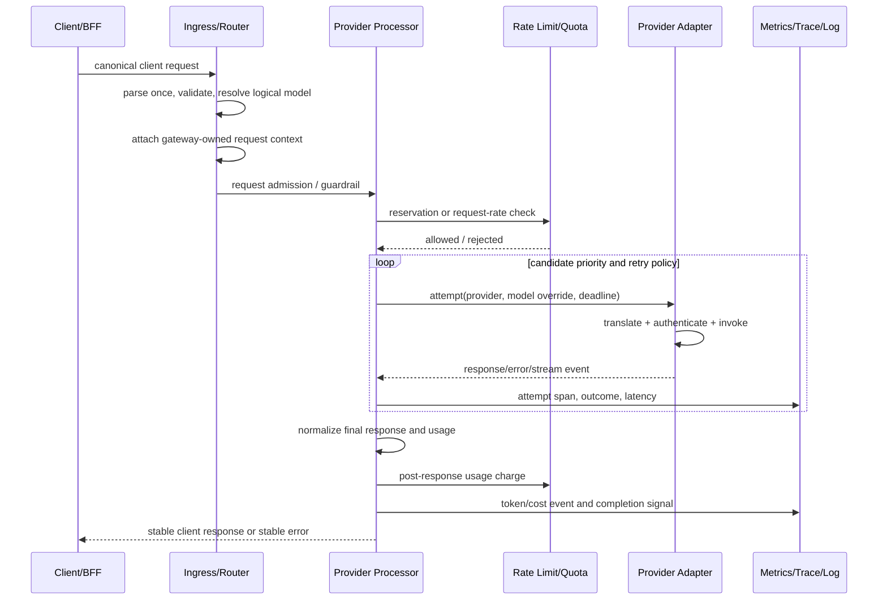

# Envoy AI Gateway 기반 LLM Gateway 설계 심층 분석

## 1. 분석 기준점

| 항목 | 값 |
|---|---|
| 분석일 | 2026-09-08 (Asia/Seoul) |
| 대상 | `envoyproxy/ai-gateway` |
| 소스 기준점 | `main`, commit `a1f1c78e0104fb680b2f02c8cda05abcc4f90814` |
| 공식 문서 버전 | 1.1로 표시되는 문서 기준 |
| 분석 깊이 | Deep: 공식 문서, 소스, 테스트, 설계 proposal 대조 |
| 목적 | 다른 언어/프레임워크에서도 재사용 가능한 LLM Gateway(Mediator System) 설계 원칙 도출 |
| 적용 맥락 | Spring AI 기반 MVC Gateway, n개 BFF/도메인 백엔드 클라이언트, 분산 배포 |

### 표기 규칙

- **FACT**: 기준 소스나 공식 문서에서 직접 확인한 동작
- **DESIGN INTENT**: proposal, 주석, 공식 설계 문서에서 확인한 의도
- **INFERENCE**: 구현을 조합해 도출한 해석
- **RECOMMENDATION**: 본 프로젝트에 적용할 권고
- **UNKNOWN**: 기준점에서 보장되지 않거나 별도 검증이 필요한 항목

## 2. 범위와 결론 요약

이 분석은 AI/LLM 트래픽을 위한 공통 게이트웨이를 다음 관점에서 분석한다.

- 비용/토큰 추적, tracing, logging
- guardrail과 정책 확장
- load balancing, fallback, retry, rate limit/quota
- 여러 공급자와 API schema/authentication 분리
- model routing과 모델명 가상화
- 언어 중립적인 abstraction/interface 및 계층 설계

가장 중요한 결론은 다음과 같다.

1. **라우팅과 공급자 호출을 한 컴포넌트에 결합하지 않는다.** 요청은 ingress에서 한 번 정규화하고, 라우팅은 후보 집합을 만들며, 실제 공급자별 변환·인증·응답 해석은 시도(attempt) 단위 adapter가 담당해야 한다.
2. **control plane과 data plane을 분리한다.** 라우팅/가격/정책/공급자 설정을 요청마다 DB에서 읽지 않고, 검증·컴파일된 immutable snapshot으로 publish한 뒤 요청 경로에서는 snapshot을 읽기만 한다.
3. **fallback은 응답 바이트가 노출되기 전까지만 안전하다.** streaming 중 일부가 이미 클라이언트로 전달되었다면 다른 모델/공급자로 투명 재시도할 수 없다. 이 상태는 fallback 대상이 아니라 종료/부분 실패 정책 대상이다.
4. **토큰 비용은 관측 데이터와 회계 원장을 분리한다.** metrics/tracing은 빠르고 저렴한 운영 신호이며, 과금·정산은 idempotency와 재처리를 지원하는 별도 durable ledger여야 한다.
5. **guardrail은 현재 구현의 핵심 기능이 아니다.** 기준점에서 확인되는 것은 구조 검증, provider 변환 검증, 로그용 redaction, 인증/인가 정책, 일부 공급자 고유 safety field다. 조직 정책용 콘텐츠 moderation/PII/DLP/prompt-injection pipeline은 별도 port와 정책 엔진으로 추가해야 한다.
6. **provider는 API schema와 인증 타입을 독립적으로 모델링한다.** OpenAI-compatible이라는 이유로 인증, URL, body, stream framing, error shape까지 동일하다고 가정하면 Bedrock/SigV4 같은 공급자에서 누수가 발생한다.
7. **클라이언트에는 논리 모델명과 표준 오류만 노출한다.** 공급자 endpoint, credential header, 내부 라우팅 헤더, Envoy metadata는 gateway 내부 계약이다.

## 3. 기준 아키텍처와 요청 흐름

공식 아키텍처는 AI-specific control/data plane을 Envoy Gateway의 일반 proxy 관리와 분리한다. AI Gateway controller가 CRD를 관찰하고 HTTPRoute/HTTPRouteFilter/extproc 설정을 생성하며, Envoy Gateway가 xDS, service discovery, load balancing, TLS를 담당한다. 데이터 plane에서는 Envoy가 요청을 받고 외부 processor가 모델 추출·변환·인증·사용량 추출을 수행한다.

- [System Architecture](https://aigateway.envoyproxy.io/docs/concepts/architecture/system-architecture/)
- [Control Plane Explained](https://aigateway.envoyproxy.io/docs/concepts/architecture/control-plane/)
- [Data Plane and Traffic Flow](https://aigateway.envoyproxy.io/docs/concepts/architecture/data-plane/)

### 3.1 요청/응답 생명주기



기준 구현의 특징은 router-level과 upstream-level을 나누는 것이다. router-level에서 body를 읽어 모델과 stream 여부를 결정하고 route cache를 지운다. Envoy가 retry/fallback할 때 router filter는 다시 호출되지 않고 upstream filter만 다시 호출할 수 있으므로, 공급자별 변환과 인증은 upstream-level에서 실행해야 한다.

**FACT**: `routerProcessor.ProcessRequestBody`는 request body를 파싱하고 gateway 소유 `x-ai-eg-model` 및 original path를 덮어쓴 뒤 `ClearRouteCache=true`를 반환한다. `upstreamProcessor.ProcessRequestHeaders`는 backend별 translator/auth를 적용한다. ([processor_impl.go](https://github.com/envoyproxy/ai-gateway/blob/a1f1c78e0104fb680b2f02c8cda05abcc4f90814/internal/extproc/processor_impl.go#L231-L471))

**DESIGN INTENT**: router-level context를 upstream retry에서도 사용하기 위해 내부 request ID로 processor 상태를 연결한다. 외부 processor의 session affinity를 보장하기 어려워 extproc sidecar/UDS 배치를 사용한다. ([control-plane.md](https://github.com/envoyproxy/ai-gateway/blob/a1f1c78e0104fb680b2f02c8cda05abcc4f90814/site/docs/concepts/architecture/control-plane.md#L106-L132), [server.go](https://github.com/envoyproxy/ai-gateway/blob/a1f1c78e0104fb680b2f02c8cda05abcc4f90814/internal/extproc/server.go#L90-L245))

### 3.2 다른 언어로 옮길 때의 핵심 분리

| 책임 | 요청 경로에서 해야 하는 일 | 요청 경로에서 하지 말아야 하는 일 |
|---|---|---|
| Ingress adapter | HTTP DTO 파싱, 인증 주체 추출, trace context 수신 | 공급자별 body 변환 |
| Request normalizer | canonical request/context 생성, logical model 결정 | DB 기반 매 요청 라우팅 |
| Route planner | 후보, priority, weight, eligibility 계산 | HTTP response serialization |
| Attempt operator | deadline, retry/fallback, circuit breaker, provider 호출 | global policy schema 파싱 |
| Provider adapter | request translation, auth, stream/error parse | 조직별 tenant 정책 결정 |
| Usage/cost | 누적 사용량, 가격 snapshot 적용, 정산 이벤트 생성 | token count를 추정값으로 조용히 확정 |
| Observation | low-cardinality metrics, trace, structured log | raw prompt/credential 기록 |
| Control plane | config validation/compile/version/publish | live request body 처리 |

## 4. Cost tracking, tracing, logging

### 4.1 Cost tracking 구현 분석

#### 토큰 사용량 모델

`internal/metrics.TokenUsage`는 input/output/total/cached input/cache creation/reasoning token을 각각 값과 `set` 여부로 보존한다. `0`과 “provider가 제공하지 않음”을 구분하는 방식이다. Anthropic/Bedrock의 explicit cache 필드는 input total을 재구성할 때 포함되어 OpenAI 계열 usage로 정규화된다.

**FACT**:

- usage를 provider translator가 추출하고 upstream response 처리에서 `Override`한다. streaming chunk가 누적값을 반복 전달해도 단순 합산하지 않는다.
- stream request에 usage가 없으면 요청 body에 `stream_options.include_usage=true`를 주입해 stream 마지막 usage를 얻는다.
- 비용은 response 완료 시점에 동적 metadata로 기록된다. streaming 중 limit을 초과하더라도 이미 admitted된 stream을 중간에 끊지 않는다.

근거: [metrics.go](https://github.com/envoyproxy/ai-gateway/blob/a1f1c78e0104fb680b2f02c8cda05abcc4f90814/internal/metrics/metrics.go#L140-L312), [endpointspec.go](https://github.com/envoyproxy/ai-gateway/blob/a1f1c78e0104fb680b2f02c8cda05abcc4f90814/internal/endpointspec/endpointspec.go#L128-L180), [processor_impl.go](https://github.com/envoyproxy/ai-gateway/blob/a1f1c78e0104fb680b2f02c8cda05abcc4f90814/internal/extproc/processor_impl.go#L529-L657), [usage-based rate limiting](https://aigateway.envoyproxy.io/docs/capabilities/traffic/usage-based-ratelimiting/)

#### 비용 계산과 quota 계산의 경계

구성에는 `OutputToken`, `InputToken`, `TotalToken`, cache token, reasoning token, CEL 계산이 있다. CEL 환경은 `model`, `backend`, `route_name`, 각 token count를 제공하고, 프로그램은 config load 시 컴파일·sanity evaluation한다.

**FACT**: [`llmcostcel`](https://github.com/envoyproxy/ai-gateway/blob/a1f1c78e0104fb680b2f02c8cda05abcc4f90814/internal/llmcostcel/cel.go#L18-L98)은 음수/비정수 비용을 거부한다. runtime config가 CEL을 매 요청 compile하지 않고 초기화 시 compile한다. ([runtime.go](https://github.com/envoyproxy/ai-gateway/blob/a1f1c78e0104fb680b2f02c8cda05abcc4f90814/internal/filterapi/runtime.go#L58-L134))

이 비용은 현재 통화(currency) 원장이라기보다 rate-limit/quota의 차감 단위다. 금액이 필요하면 다음을 별도로 둬야 한다.

```text
UsageSnapshot (provider response)
        |
        +--> QuotaCostCalculator -> distributed quota charge
        |
        +--> PriceCalculator(pricing snapshot) -> MoneyCost
                                      |
                                      +--> idempotent CostLedger(PostgreSQL)
```

**RECOMMENDATION**:

- token usage는 `Optional` 필드 또는 값+availability 상태로 모델링한다. 0으로 기본화하면 provider 미지원과 실제 0을 구분할 수 없다.
- `UsageAccumulator`는 cumulative usage와 delta usage를 구분하고, 동일 event 재처리에 idempotent해야 한다.
- 가격은 `PricingSnapshot(version, provider, model, tokenType, unitPrice, effectiveAt)`으로 version을 고정한다. 나중에 가격표가 바뀌어도 과거 요청의 비용을 재현할 수 있어야 한다.
- 각 attempt의 비용과 최종 client request 비용을 구분한다. fallback 시 실패 attempt의 provider 과금 가능성은 공급자별로 다르므로 `AttemptCost`와 `RequestCost`를 따로 저장한다.
- `request_id + attempt_id + usage_source`를 정산 deduplication key로 둔다. 재시도/consumer 재처리/observability exporter 재전송이 중복 청구를 만들지 않아야 한다.
- 성공 응답이지만 usage가 없으면 `CostStatus=UNKNOWN` 또는 `ESTIMATED`로 남기고, 조용히 0원 처리하지 않는다.

#### 분산 quota와 비용 차감

공식 usage-based rate limit은 Envoy Gateway Global Rate Limit API와 Redis 기반 인프라를 사용한다. 요청 시 admission check와 응답 완료 후 usage charge가 분리된다. `QuotaPolicy`는 per-model quota, CEL cost, header bucket, shadow mode를 제공하지만 현재 기준점에서 “quota가 남은 후보만 골라서 라우팅”하는 기능은 proposal 수준이다.

- [Usage-based Rate Limiting](https://aigateway.envoyproxy.io/docs/capabilities/traffic/usage-based-ratelimiting/)
- [Quota Policy](https://aigateway.envoyproxy.io/docs/capabilities/traffic/quota-policy/)
- [Quota-aware routing proposal](https://github.com/envoyproxy/ai-gateway/blob/a1f1c78e0104fb680b2f02c8cda05abcc4f90814/docs/proposals/009-quota-aware-routing/proposal.md)
**RECOMMENDATION**: Redis는 빠른 admission/reservation과 window counter의 저장소로 사용하고, PostgreSQL은 usage/cost event의 durable ledger로 사용한다. 두 저장소를 하나의 트랜잭션으로 묶으려 하지 말고, `reservation_id`와 outbox/reconciliation으로 eventual consistency를 관찰 가능하게 만든다.

### 4.2 Metrics 설계

기준 구현은 다음 GenAI metric을 사용한다.

- `gen_ai.client.token.usage`
- `gen_ai.server.request.duration`
- `gen_ai.server.time_to_first_token`
- `gen_ai.server.time_per_output_token`

주요 attribute는 operation, provider, original/request/response model, token type, error type이다. 모델명은 논리 요청 모델과 실제 응답 모델을 모두 보존한다. streaming inter-token latency는 첫 token 이후 output token 수로 평균을 낸다.

근거: [genai.go](https://github.com/envoyproxy/ai-gateway/blob/a1f1c78e0104fb680b2f02c8cda05abcc4f90814/internal/metrics/genai.go#L10-L120), [metrics_impl.go](https://github.com/envoyproxy/ai-gateway/blob/a1f1c78e0104fb680b2f02c8cda05abcc4f90814/internal/metrics/metrics_impl.go#L68-L190)

**RECOMMENDATION**:

- metrics label에 raw user ID, request ID, prompt, full backend URL을 넣지 않는다. tenant는 bounded tier, hashed tenant group, plan 같은 낮은 cardinality 값으로 제한한다.
- request-level metric과 attempt-level metric을 분리한다. retry가 늘어났다고 client request 수가 늘어난 것으로 보이면 안 된다.
- 최소 지표는 `request_count`, `request_duration`, `attempt_count`, `fallback_count`, `provider_error_count`, `tokens_by_type`, `estimated_cost`, `quota_rejection`, `guardrail_block`, `stream_ttft`, `stream_inter_token_latency`다.
- `model.requested`, `model.effective`, `provider`, `route`, `outcome`, `error.category`만 기본 label로 두고, tenant/feature labels는 allowlist로 설정한다.
- error label은 공급자 원문 오류 문자열이 아닌 제한된 분류값을 사용한다. 기준 구현도 GenAI `error.type`에 low-cardinality HTTP status/fallback 값을 사용한다. ([httperr.go](https://github.com/envoyproxy/ai-gateway/blob/a1f1c78e0104fb680b2f02c8cda05abcc4f90814/internal/tracing/httperr/errortype.go#L15-L73))

### 4.3 Tracing 설계

기준 구현은 request headers에서 trace context를 추출하고 provider 호출 전에 span context를 전달한다. OpenInference와 OpenTelemetry GenAI semantic convention을 선택할 수 있으며 동시에 두 convention을 내보내지 않는다.

- OpenInference는 prompt/response, invocation parameters 등에 대해 세분화된 hide 설정을 제공한다.
- GenAI convention은 message content capture를 별도 opt-in으로 둔다.
- stream span은 first token, output token, response model, provider, error 등을 기록하고 End-of-Stream에서 종료한다.
- session ID 같은 고 cardinality 값은 기본으로 넣지 않고 명시적인 header mapping으로만 추가한다.

근거: [tracing.go](https://github.com/envoyproxy/ai-gateway/blob/a1f1c78e0104fb680b2f02c8cda05abcc4f90814/internal/tracing/tracing.go#L42-L154), [OpenInference config](https://github.com/envoyproxy/ai-gateway/blob/a1f1c78e0104fb680b2f02c8cda05abcc4f90814/internal/tracing/openinference/config.go#L15-L151), [GenAI config](https://github.com/envoyproxy/ai-gateway/blob/a1f1c78e0104fb680b2f02c8cda05abcc4f90814/internal/tracing/otelgenai/config.go#L10-L54), [Tracing docs](https://aigateway.envoyproxy.io/docs/capabilities/observability/tracing/)

**RECOMMENDATION**:

- span hierarchy는 `gateway.request` → `gateway.attempt` → provider HTTP client span으로 구성한다. fallback은 새로운 root span이 아니라 같은 request trace의 sibling attempt로 표현한다.
- span에는 requested model, effective model, provider, deployment, attempt number, fallback index, retry index, outcome, usage availability를 둔다.
- prompt/response content capture default는 off로 한다. capture를 켜더라도 tenant/data classification별 sampling과 최대 크기 제한을 적용한다.
- 비용 계산 실패는 trace status와 accounting event에 남기되, provider response를 정상으로 위장하지 않는다.

### 4.4 Logging과 redaction

기준 구현은 다음을 분리한다.

- credential header는 debug log에서도 redaction
- body는 endpoint별 redactor가 구조를 유지한 redacted copy를 생성
- 문자열은 길이와 hash만 남겨 동일 payload correlation을 가능하게 함
- access log에는 dynamic metadata로 계산된 model/provider/token usage를 기록
- 로그용 redacted body는 실제 provider request로 재사용하지 않음

근거: [redaction.go](https://github.com/envoyproxy/ai-gateway/blob/a1f1c78e0104fb680b2f02c8cda05abcc4f90814/internal/redaction/redaction.go#L6-L104), [endpointspec.go](https://github.com/envoyproxy/ai-gateway/blob/a1f1c78e0104fb680b2f02c8cda05abcc4f90814/internal/endpointspec/endpointspec.go#L35-L97), [Access Logs](https://aigateway.envoyproxy.io/docs/capabilities/observability/accesslogs/)

**RECOMMENDATION**:

- 로그에 남길 필드는 `request_id`, trace ID, route ID, logical model, provider, deployment ID, attempt, status, latency, token counts, cost status로 제한한다.
- request/response content는 기본적으로 기록하지 않는다. 필요한 경우 별도의 secure sink, 짧은 TTL, 암호화, 접근감사, sampling을 사용한다.
- credential header뿐 아니라 `Authorization`, `X-Api-Key`, provider key suffix, signed header, dynamic metadata, internal routing header를 공통 민감 필드 registry로 관리한다.
- redaction 실패는 원문 fallback을 하지 말고 body logging을 생략한다.
- log와 trace에 동일한 `request_id`/`attempt_id`를 사용하되, 클라이언트가 주입한 ID를 내부 correlation key로 그대로 신뢰하지 않는다.

## 5. Guardrails

### 5.1 현재 기준점에서 확인되는 범위

**FACT**:

- malformed JSON/request body는 user-facing 400으로 처리한다.
- provider 변환 전에 지원하지 않는 body union/field 조합은 422로 처리한다.
- provider별 response error는 canonical error shape으로 변환한다.
- Envoy Gateway의 access control/JWT/mTLS/external authorization을 조합할 수 있다. ([Security](https://aigateway.envoyproxy.io/docs/capabilities/security/))
- 로그/trace용 redaction이 있지만 이는 정책 판정이 아니라 관측 데이터 보호다.
- Vertex/Gemini의 `safetySettings`처럼 공급자 고유 필드를 변환할 수 있다. 이 필드는 gateway의 조직 공통 moderation policy가 아니라 provider API 옵션이다. ([Extension Fields](https://aigateway.envoyproxy.io/docs/0.5/capabilities/llm-integrations/vendor-specific-fields/))

**UNKNOWN / LIMITATION**: 기준 소스와 공식 기능 문서에는 조직 공통의 generic content moderation, PII/DLP 검사, prompt-injection 탐지, output safety classifier를 연결하는 first-class `Guardrail` CRD 또는 request/response guardrail chain이 확인되지 않는다. 공식 terminology에 Content Filtering 정의가 존재하는 것과 실제 실행 pipeline이 제공되는 것은 다르다. ([terminology](https://aigateway.envoyproxy.io/docs/terminology/))

따라서 현재 구현을 guardrail-complete라고 표현하면 안 된다. 현재 범위는 **입력 구조 검증 + 인증/인가 + 변환 안전성 + 관측 데이터 redaction + provider-native safety option**이다.

### 5.2 권장 guardrail abstraction

Guardrail을 하나의 거대한 `PolicyService`로 만들지 말고, 순서가 있고 각 단계가 독립적인 `GuardrailStage` chain으로 둔다.

```text
InboundRequest
  -> StructuralValidation
  -> Identity / AuthorizationPolicy
  -> ModelAndQuotaPolicy
  -> InputContentGuardrail
  -> RouteEligibility
  -> ProviderAttempt
  -> OutputContentGuardrail
  -> ResponseMapping
```

권장 결과 타입은 다음과 같다.

```text
GuardrailDecision
  ALLOW
  TRANSFORM (sanitized request/response)
  BLOCK (safe public error, policy code)
  DEFER (provider-native policy decides)
  ERROR (guardrail dependency failure)
```

각 stage는 아래 메타데이터를 반환해야 한다.

```text
stage_id, policy_version, decision, reason_code,
latency, transformed, confidence(optional), audit_reference
```

원문 reason, classifier score, prompt fragment는 public response나 일반 metrics에 넣지 않는다.

### 5.3 Streaming guardrail의 설계 선택

응답을 이미 client에 보낸 이후에는 block 결과를 되돌릴 수 없으므로 streaming은 세 가지 모드 중 하나를 명시해야 한다.

| 모드 | 방식 | 장점 | 비용/한계 |
|---|---|---|---|
| Preflight only | 첫 byte 전 입력만 검사, 출력은 provider 정책에 위임 | 가장 낮은 latency | output 정책 보장이 약함 |
| Buffered output | 전체 응답을 모은 뒤 검사하고 전송 | 차단 정확성/계약 안정성 | latency, memory, streaming 이점 감소 |
| Chunk holdback | 일정 window를 보류하고 incremental 검사 | 일부 streaming 유지 | 경계가 걸친 유해 표현, classifier state, 부분 실패 복잡성 |

**RECOMMENDATION**:

- 일반 BFF 업무 요청은 `Preflight + provider native + output block before first byte`를 기본으로 한다.
- 조직 정책상 output moderation이 필수인 route만 `Buffered output`을 opt-in한다.
- `Chunk holdback`은 classifier가 incremental state와 bounded memory를 명시적으로 제공할 때만 도입한다.
- guardrail block은 fallback하지 않는다. 다른 provider가 같은 금지 입력을 처리하도록 우회하는 것은 정책 우회가 되기 때문이다.
- guardrail dependency timeout/error는 stage별 `fail-open`/`fail-closed`를 설정하되, 보안/규제 route는 fail-closed, 일반 내부 route는 shadow mode부터 시작한다.

권장 port 예시는 다음과 같다.

```kotlin
interface GuardrailPort {
    fun inspectInput(request: CanonicalChatRequest, context: RequestContext): GuardrailDecision
    fun inspectOutput(output: CanonicalOutput, context: RequestContext): GuardrailDecision
}
```

어댑터는 `GuardrailPort`를 구현하고 application layer는 `GuardrailDecision`만 이해한다. 외부 moderation API SDK, Spring bean, HTTP client는 adapter에만 둔다.

## 6. Load balancing, fallback, retry, rate limit

### 6.1 Load balancing: priority와 weight의 분리

`AIGatewayRouteRuleBackendRef`는 `weight`, `priority`, `modelNameOverride`를 가진다.

- `priority`: 낮은 숫자가 우선되는 fallback tier
- `weight`: 같은 priority에서의 traffic distribution
- `modelNameOverride`: 논리 모델과 provider가 실제 실행할 모델 ID의 매핑

AI Gateway controller는 backendRef priority를 xDS endpoint priority에 넣기 위해 extension server에서 endpoint metadata를 보강한다. Envoy Gateway가 일반 service discovery/LB를 담당하고 AI Gateway는 AI-specific priority/model metadata만 보완한다.

근거: [AIGatewayRoute API](https://github.com/envoyproxy/ai-gateway/blob/a1f1c78e0104fb680b2f02c8cda05abcc4f90814/api/v1beta1/ai_gateway_route.go#L216-L400), [route controller](https://github.com/envoyproxy/ai-gateway/blob/a1f1c78e0104fb680b2f02c8cda05abcc4f90814/internal/controller/ai_gateway_route.go#L256-L311), [cluster modification](https://github.com/envoyproxy/ai-gateway/blob/a1f1c78e0104fb680b2f02c8cda05abcc4f90814/internal/extensionserver/post_translate_modify.go#L390-L432)

**언어 중립 알고리즘**:

```text
eligible = candidates where enabled && health == eligible && policy allows
minPriority = min(candidate.priority for candidate in eligible)
pool = candidates where candidate.priority == minPriority
selected = weightedChoice(pool, candidate.weight)
```

weight는 우선순위 필터 이후에만 적용한다. primary가 살아 있는데 fallback을 weight 10%로 섞는 것은 `priority` 의미와 충돌한다.

### 6.2 Fallback/retry 생명주기

기준 fallback 문서는 여러 backendRef와 `BackendTrafficPolicy` retry를 조합한다. per-priority attempt 수, total retry 수, per-retry timeout, retriable status를 설정한다. stream idle timeout은 첫 byte가 오기 전에 연결이 멈췄을 때 다음 backend로 넘어갈 기회를 만든다.

- [Provider Fallback](https://aigateway.envoyproxy.io/docs/capabilities/traffic/provider-fallback/)
- [Data Plane and Traffic Flow](https://aigateway.envoyproxy.io/docs/concepts/architecture/data-plane/)

**FACT**:

- router filter는 request body/model context를 이미 만들고, retry 시 upstream filter가 다시 공급자별 변환/인증을 수행한다.
- translator는 retry 때 원래 canonical request를 다시 변환해야 하므로 body mutation은 idempotent해야 한다. `ReplaceInPlace=false`가 기본인 이유가 이것이다. ([translator.go](https://github.com/envoyproxy/ai-gateway/blob/a1f1c78e0104fb680b2f02c8cda05abcc4f90814/internal/translator/translator.go#L40-L172))
- 첫 응답 byte 이후에는 다른 provider로 재시도하지 않는 것이 안전하다.
- stream idle timeout은 “첫 byte 이전”과 “중간 stream”을 다르게 취급한다. 중간 stream reset은 이미 일부 결과가 노출되었으므로 504 종료가 된다. ([post_translate_modify.go](https://github.com/envoyproxy/ai-gateway/blob/a1f1c78e0104fb680b2f02c8cda05abcc4f90814/internal/extensionserver/post_translate_modify.go#L244-L292))

#### 실패 분류

```text
FailureClass
  CLIENT_INVALID       -> no retry, 4xx
  AUTHENTICATION       -> no retry, provider/config alert
  AUTHORIZATION        -> no retry or policy fallback only
  RATE_LIMITED         -> bounded retry if Retry-After and budget allow
  TRANSIENT_NETWORK    -> retry same deployment, then fallback
  PROVIDER_5XX         -> retry/fallback if no visible bytes
  TIMEOUT_BEFORE_FIRST -> retry/fallback if no visible bytes
  STREAM_INTERRUPTED   -> terminate current response, no transparent fallback
  GUARDRAIL_BLOCK      -> no fallback
  ACCOUNTING_FAILURE   -> response policy independent from provider retry
```

**RECOMMENDATION**: `RetryPolicy`가 HTTP status만 보고 결정하지 않도록 `failure_class`, `emitted_bytes`, `request_disposition`, `retry_index`, `remaining_deadline`을 함께 입력받는다. 특히 non-idempotent tool side effect가 있는 provider endpoint는 기본 retry를 금지하고 idempotency key가 있는 경우에만 허용한다.

### 6.3 Rate limit과 quota

둘은 목적이 다르다.

| 종류 | 목적 | 예 |
|---|---|---|
| Request rate limit | 유입 속도/동시성 제한 | tenant당 20 req/s |
| Token usage limit | token 소모 속도 제한 | tenant당 분당 100k tokens |
| Cumulative quota | 기간 누적 예산 | model당 시간당 1M tokens |
| Concurrency limit | 실행 중 요청 수 제한 | deployment당 50개 |

기준 구현은 rate-limit descriptor를 `backend -> model -> bucket-rule(header)` 계층으로 구성하고, response stream 완료 시 usage를 metadata로 넣어 차감한다. header selector는 Exact/Distinct/RegularExpression을 지원한다. descriptor는 deterministic output을 위해 header name을 정렬하고 동일 key/value subtree를 merge한다.

근거: [quota_ratelimit.go](https://github.com/envoyproxy/ai-gateway/blob/a1f1c78e0104fb680b2f02c8cda05abcc4f90814/internal/extensionserver/quota_ratelimit.go#L246-L417), [rate-limit translator](https://github.com/envoyproxy/ai-gateway/blob/a1f1c78e0104fb680b2f02c8cda05abcc4f90814/internal/ratelimit/translator/translator.go#L36-L415), [descriptor merge](https://github.com/envoyproxy/ai-gateway/blob/a1f1c78e0104fb680b2f02c8cda05abcc4f90814/internal/ratelimit/translator/merge.go#L13-L80), [rate-limit runner](https://github.com/envoyproxy/ai-gateway/blob/a1f1c78e0104fb680b2f02c8cda05abcc4f90814/internal/ratelimit/runner/runner.go#L36-L131)

**FACT / LIMITATION**:

- Redis는 rate-limit data 저장에 필요하다.
- usage는 response 완료 후 알려지므로 현재 request를 초과 사용했다고 중간에 차단하지 않는다.
- `QuotaPolicy`는 선택된 backend/model에 대한 quota enforcement다.
- model quota 이름이 route의 `modelNameOverride`와 다르면 적용되지 않을 수 있고, 공식 문서도 이 점을 경고한다.
- 여러 후보 중 quota가 남은 backend를 먼저 선택하는 quota-aware routing은 별도 proposal이며 현재 일반 동작으로 간주하면 안 된다.
- 기준 AI Gateway 자체는 PostgreSQL 원장을 제공하지 않는다. PostgreSQL은 본 프로젝트의 정산/usage ledger adapter로 별도 설계해야 한다.

#### 분산 rate limit 권장 패턴

```text
1. Resolve tenant + logical model + route + policy version
2. Redis atomic admission/reservation
3. Candidate selection (health/circuit/priority/weight)
4. Provider attempt
5. Final usage observed
6. Redis atomic charge/reconcile reservation
7. PostgreSQL append-only usage event + outbox status
```

rate-limit service 장애 시 기본값은 비용 보호 목적에 따라 나눈다.

- 인증/보안/고비용 route: fail-closed
- 일반 low-risk route: 제한된 fail-open + alert
- shadow mode: 판정/telemetry는 실행하지만 요청은 허용

Redis script는 check-and-reserve를 원자적으로 처리해야 하며, JVM local counter를 보조 cache로 두더라도 정답으로 사용하지 않는다. PostgreSQL은 `usage_event`와 `cost_entry`를 append-only로 기록하고 `request_id/attempt_id` unique constraint로 중복을 방지한다.

## 7. Multi-vendor 설계

### 7.1 API schema와 authentication의 독립

`AIServiceBackend`는 inbound schema와 outbound schema를 구분하고, `BackendSecurityPolicy`는 API key, AWS credentials, Azure/GCP credentials 등을 별도 리소스로 다룬다.

**FACT**:

- `VersionedAPISchema`는 name/version/prefix를 가진다.
- provider support와 authentication support는 별도 관심사다.
- OpenAI input을 AWS Bedrock Converse/InvokeModel, Anthropic, GCP 등으로 변환하는 translator가 있다.
- API key는 `Authorization`, `api-key`, `x-api-key` 등 provider에 맞게 적용한다.
- AWS는 단순 header injection이 아니라 SigV4 signing으로 별도 handler를 사용하며, default credential chain과 per-request override를 지원한다.

근거: [shared_types.go](https://github.com/envoyproxy/ai-gateway/blob/a1f1c78e0104fb680b2f02c8cda05abcc4f90814/api/v1beta1/shared_types.go#L8-L102), [AIServiceBackend](https://github.com/envoyproxy/ai-gateway/blob/a1f1c78e0104fb680b2f02c8cda05abcc4f90814/api/v1beta1/ai_service_backend.go#L42-L104), [BackendSecurityPolicy](https://github.com/envoyproxy/ai-gateway/blob/a1f1c78e0104fb680b2f02c8cda05abcc4f90814/api/v1beta1/backendsecurity_policy.go#L25-L135), [auth factory](https://github.com/envoyproxy/ai-gateway/blob/a1f1c78e0104fb680b2f02c8cda05abcc4f90814/internal/backendauth/auth.go#L15-L60), [AWS auth](https://github.com/envoyproxy/ai-gateway/blob/a1f1c78e0104fb680b2f02c8cda05abcc4f90814/internal/backendauth/aws.go#L27-L145)

이 분리는 다음 표와 같이 모델링해야 한다.

```text
Logical API: OpenAI Chat Completions
       |
       +-- ProviderBinding(OpenAI schema, OpenAI auth, base URL)
       +-- ProviderBinding(AWS Bedrock schema, SigV4 auth, region/endpoint)
       +-- ProviderBinding(OpenRouter/OpenAI-compatible schema, API key auth)
```

### 7.2 EndpointSpec + Translator 패턴

기준 구현의 endpoint abstraction은 request/response/stream chunk 타입과 다음 책임을 함께 묶는다.

- request body parse
- stream 여부/원래 모델 추출
- translator 선택
- request redaction
- multipart 지원 여부

Translator의 공통 핵심 인터페이스는 `RequestBody`, `ResponseHeaders`, `ResponseBody`, `ResponseError`다. content type setter, request headers setter, header value filter, response redactor는 optional interface로 분리한다.

근거: [EndpointSpec](https://github.com/envoyproxy/ai-gateway/blob/a1f1c78e0104fb680b2f02c8cda05abcc4f90814/internal/endpointspec/endpointspec.go#L35-L180), [Translator](https://github.com/envoyproxy/ai-gateway/blob/a1f1c78e0104fb680b2f02c8cda05abcc4f90814/internal/translator/translator.go#L40-L157)

**RECOMMENDATION**:

- Spring AI의 `ChatModel`/`ChatClient`를 모든 provider 차이를 숨기는 유일한 abstraction으로 사용하지 않는다. 공통 model invocation과 gateway transport policy는 다른 계층이다.
- application은 `CanonicalChatRequest`, `ProviderResponse`, `ProviderFailure`만 이해한다.
- adapter 내부에서 Spring AI request/response와 provider SDK response를 mapping한다.
- 신규 vendor는 `ProviderAdapter`/`ProviderTranslator`/`ProviderAuth`/`ProviderErrorMapper`를 등록하고 application service를 수정하지 않아야 한다.
- provider-specific field는 명시적인 extension registry와 strict/lenient 모드를 둔다. 기준 문서의 “지원되지 않는 field/backend는 무시” 방식은 편리하지만 오타를 조용히 무시할 위험이 있으므로 운영 기본값은 warning 또는 reject가 안전하다.

### 7.3 Provider 오류의 canonicalization

Bedrock 오류는 `x-amzn-errortype`와 body를 읽어 OpenAI error envelope로 변환한다. 이때 status와 provider error type을 보존할 수 있지만, public contract에는 provider 내부 endpoint나 raw stack trace를 노출하지 않는다.

근거: [Bedrock error conversion](https://github.com/envoyproxy/ai-gateway/blob/a1f1c78e0104fb680b2f02c8cda05abcc4f90814/internal/translator/converse_helper.go#L360-L407), [AWS Anthropic translator](https://github.com/envoyproxy/ai-gateway/blob/a1f1c78e0104fb680b2f02c8cda05abcc4f90814/internal/translator/openai_awsanthropic.go#L43-L130)

권장 내부 오류 모델:

```text
ProviderFailure {
  provider
  deployment
  phase: CONNECT | AUTH | REQUEST_TRANSLATION | PROVIDER_RESPONSE | RESPONSE_TRANSLATION
  status
  provider_code(optional, sanitized)
  retryable
  retry_after(optional)
  emitted_bytes
  cause(internal only)
}
```

## 8. Model routing

### 8.1 기준 구현의 routing mechanics

기준 구현은 요청 body에서 model을 읽고 gateway 소유 header에 기록한 뒤 HTTPRoute header match를 재평가한다. client가 같은 header를 보내도 gateway가 덮어쓴다. 이는 client가 routing identity를 위조하거나 다른 model quota bucket에 들어가는 것을 막는다.

**FACT**:

- route rule은 path/header/model header를 조합할 수 있다.
- model 기반 route match는 body parse 이후 `ClearRouteCache`가 필요하다.
- `modelNameOverride`는 downstream logical model과 provider 실제 model을 분리한다.
- `/v1/models`는 host-specific model list를 exact/wildcard로 선택하고, unmatched host는 unscoped models로 제한해 scoped model leakage를 줄인다.

근거: [route API](https://github.com/envoyproxy/ai-gateway/blob/a1f1c78e0104fb680b2f02c8cda05abcc4f90814/api/v1beta1/ai_gateway_route.go#L70-L110), [router processor](https://github.com/envoyproxy/ai-gateway/blob/a1f1c78e0104fb680b2f02c8cda05abcc4f90814/internal/extproc/processor_impl.go#L231-L331), [models processor](https://github.com/envoyproxy/ai-gateway/blob/a1f1c78e0104fb680b2f02c8cda05abcc4f90814/internal/extproc/models_processor.go#L18-L225), [model virtualization](https://aigateway.envoyproxy.io/docs/capabilities/traffic/model-virtualization/)

### 8.2 정적 routing과 동적 routing

기준 구현의 route source는 Kubernetes CRD와 생성된 xDS이며, request path processor registry는 exact path lookup이다. 이는 예측 가능성과 빠른 data path를 제공하지만, latency/cost/health를 매 요청 학습하는 adaptive router는 아니다.

구분해야 할 routing 수준은 다음과 같다.

| 수준 | 입력 | 권장 구현 |
|---|---|---|
| Contract routing | path, method, content type | ingress/endpoint registry |
| Logical model routing | logical model, tenant, feature | immutable route snapshot |
| Provider eligibility | health, circuit, quota, capability | request-time policy evaluation |
| Load balancing | priority, weight | deterministic candidate selector |
| Adaptive routing | latency, cost, quality, queue | 별도 feedback/control loop |

**RECOMMENDATION**: adaptive routing을 첫 단계에서 application service에 넣지 않는다. 먼저 정적 snapshot + health/circuit/quota eligibility를 안정화하고, 후속 단계에서 windowed metrics를 이용한 score 계산을 control plane에서 수행한다. request path에서 DB 또는 metrics backend를 조회하면 latency와 장애 전파가 커진다.

### 8.3 언어 중립 routing 알고리즘

```text
route(request, snapshot, runtimeState):
  logicalModel = request.model
  rule = snapshot.routes.match(path, headers, logicalModel)
  if rule == none:
      return ROUTE_NOT_FOUND

  candidates = rule.backends
      .filter(enabled)
      .filter(capability supports request)
      .filter(runtimeState.circuit != OPEN)
      .filter(runtimeState.quota admission != REJECT)

  if candidates.empty:
      return NO_ELIGIBLE_DEPLOYMENT

  priority = minimum(c.priority)
  pool = candidates.where(c.priority == priority)
  return weightedChoice(pool, c.weight)
```

후속 attempt에서 현재 deployment는 excluded set에 넣어 동일 endpoint 무한 반복을 막고, 정책에 따라 같은 deployment retry 횟수와 다른 deployment fallback 횟수를 독립적으로 관리한다.

### 8.4 Quota-aware routing 적용 시 주의

quota가 남은 후보만 선택하려면 admission check가 route selection보다 앞서 후보별로 실행되어야 한다. 그러나 이것은 단순히 rate limit filter를 붙이는 것과 다르다.

```text
candidate set
   -> quota availability check for each candidate
   -> remove exhausted candidates
   -> lowest priority
   -> weighted selection
   -> final stream-done charge for selected candidate
```

**DESIGN INTENT**: 기준 proposal은 이 순서를 명시하지만, 현재 stable enforcement는 Envoy가 이미 선택한 backend를 대상으로 quota를 적용하는 형태다. 따라서 본 프로젝트에서는 `QuotaAvailabilityPort`를 별도 port로 두고, 적용 전까지는 quota rejection과 routing fallback의 의미를 혼합하지 않는다.

## 9. Abstraction / interface design pattern

### 9.1 권장 모듈 계층

현재 Spring 프로젝트의 모듈 방향은 `contract`, `core`, `domain`, `application`, `adapters`, `app`으로 나뉘어 있으며, 이 구조는 기준 구현의 `filterapi`와 runtime processor 분리 원칙을 옮기기에 적합하다.

```text
llm-gateway-contract
  inbound DTO, OpenAPI, public error/response schema

llm-gateway-core
  identifiers, enums, value objects, no Spring/HTTP/provider dependency

llm-gateway-domain
  canonical request, routing plan, usage/cost, failure semantics, pure policy

llm-gateway-application
  QueryIn/CommandIn, operations, operators, out ports, orchestration

llm-gateway-adapters
  Spring AI/provider adapters, Redis, PostgreSQL, Micrometer/OTel, security

llm-gateway-app
  MVC controllers, configuration, exception mapper, deployment wiring
```

의존성 방향은 아래만 허용한다.

```text
app -> adapters -> application -> domain -> core
app -> contract
adapters -> contract (필요할 때만 DTO mapping)
domain/core -X-> Spring, Spring AI, Redis, PostgreSQL, HTTP client
```

### 9.2 In Port

클라이언트 사용 사례는 기술 이름이 아니라 계약 이름으로 표현한다.

```kotlin
interface ChatCompletionQueryIn {
    fun complete(request: CanonicalChatRequest, context: RequestContext): GatewayResponse
}

interface ChatCompletionCommandIn {
    fun stream(request: CanonicalChatRequest, context: RequestContext): Sequence<GatewayEvent>
}

interface RoutingQueryIn {
    fun resolve(request: RoutingQuery): RoutingSnapshotView
}

interface RoutingCommandIn {
    fun publish(command: RoutingUpdateCommand): RoutingSnapshotView
}
```

HTTP controller는 이 port만 호출한다. `ChatCompletionRequest` DTO, Spring `HttpServletRequest`, `ResponseEntity`, provider SDK 타입은 application port에 노출하지 않는다.

### 9.3 Out Port

```kotlin
interface RoutePlannerPort {
    fun plan(request: CanonicalChatRequest, context: RequestContext, excluded: Set<DeploymentId>): RoutingPlan
}

interface ProviderInvokerPort {
    fun complete(attempt: ProviderAttempt, context: AttemptContext): ProviderResponse
    fun stream(attempt: ProviderAttempt, context: AttemptContext): Sequence<ProviderChunk>
}

interface RateLimiterPort {
    fun reserve(key: RateLimitKey, cost: ReservationCost, deadline: Instant): Reservation
    fun charge(reservation: Reservation, usage: UsageSnapshot): ChargeResult
    fun release(reservation: Reservation): ReleaseResult
}

interface QuotaAvailabilityPort {
    fun check(candidates: List<Candidate>, key: RateLimitKey): CandidateEligibility
}

interface CircuitBreakerPort {
    fun allow(deployment: DeploymentId): CircuitPermission
    fun record(deployment: DeploymentId, outcome: AttemptOutcome)
}

interface PricingCatalogPort {
    fun snapshot(provider: Vendor, model: String, at: Instant): PricingSnapshot?
}

interface AttemptObserverPort {
    fun started(context: AttemptContext)
    fun completed(context: AttemptContext, outcome: AttemptOutcome, usage: UsageSnapshot?)
}

interface AttemptAccountingPort {
    fun record(event: UsageAccountingEvent): AccountingResult
}

interface DeploymentRegistryPort {
    fun currentSnapshot(): RoutingSnapshot
}

interface GuardrailPort {
    fun inspectInput(request: CanonicalChatRequest, context: RequestContext): GuardrailDecision
    fun inspectOutput(output: CanonicalOutput, context: RequestContext): GuardrailDecision
}
```

`RoutePlannerPort`와 `ProviderInvokerPort`를 합치지 않는 것이 중요하다. planner는 “어디로 보낼지”를 결정하고 invoker는 “선택된 deployment에 어떻게 보낼지”만 안다. `RateLimiterPort`는 request-rate/token quota의 저장소 구현을 모르며, Redis adapter에서 원자성/TTL을 구현한다. `AttemptAccountingPort`는 PostgreSQL adapter에서 idempotent event insert/outbox를 구현한다.

### 9.4 Application Service와 Operation/Operator

Application service는 얇은 inbound port facade로 두고, 실제 논리 단위는 operation/operator로 나눈다.

```text
ChatCompletionQueryIn
  -> CompleteChatOperation
       -> RequestAdmissionOperator
       -> RoutePlanningOperator
       -> CompleteAttemptOperator
       -> CostCalculationOperator
       -> CompletionAccountingOperator

ChatCompletionCommandIn
  -> StreamChatOperation
       -> RequestAdmissionOperator
       -> StreamAttemptOperator
       -> StreamGuardrailOperator
       -> CompletionAccountingOperator
```

권장 책임은 다음과 같다.

- `RequestAdmissionOperator`: client auth context, schema, input guardrail, rate-limit reservation
- `RoutePlanningOperator`: snapshot과 runtime eligibility로 candidate plan 생성
- `CompleteAttemptOperator`: 한 deployment에 대한 provider invocation과 response mapping
- `StreamAttemptOperator`: stream event 전달, emitted byte state, end-of-stream usage
- `CostCalculationOperator`: usage + pricing snapshot으로 비용 계산
- `CompletionAccountingOperator`: durable event 기록 및 reconciliation 상태
- `FailurePolicy`: retry/fallback/no-retry 판단만 담당

Operation은 순서를 조율하고 Operator는 한 가지 정책/단위를 수행한다. Operator가 서로 application service를 호출하게 만들면 순환 의존성과 책임 중복이 생기므로, 모두 같은 out port와 명시적 context를 사용한다.

### 9.5 Runtime snapshot 패턴

기준 구현의 `NewRuntimeConfig`는 auth handler와 CEL을 config load 시 준비한다. 요청 경로에서는 compiled program과 backend map을 사용한다. 이는 다음 패턴으로 일반화할 수 있다.

```text
ControlPlaneSource
  -> ConfigValidator
  -> SnapshotCompiler
      - route match index
      - provider capability index
      - compiled cost expression
      - credential reference
      - pricing version
      - policy version
  -> AtomicSnapshotPublisher(version, checksum)
  -> DataPlane read-only snapshot
```

snapshot은 version/checksum과 schema compatibility를 가져야 하며, 일부 pod가 구버전인 rolling deployment 중에는 호환되지 않는 config를 거부하고 이전 snapshot으로 계속 처리한다. runtime DB refresh가 실패했다고 이미 정상 동작 중인 snapshot을 즉시 비우지 않는다.

근거: [filterapi runtime](https://github.com/envoyproxy/ai-gateway/blob/a1f1c78e0104fb680b2f02c8cda05abcc4f90814/internal/filterapi/runtime.go#L18-L134), [filterapi boundary](https://github.com/envoyproxy/ai-gateway/blob/a1f1c78e0104fb680b2f02c8cda05abcc4f90814/internal/filterapi/filterconfig.go#L8-L107)

## 10. Public contract과 예외 표준화 권고

기준 구현은 내부 extproc local reply에서 400/401/422 등을 JSON으로 만들고, provider error는 translator가 canonical provider-facing schema로 바꾼다. 본 프로젝트의 n개 BFF가 안정적으로 처리하려면 HTTP public contract를 한 단계 더 명확히 해야 한다.

### 10.1 권장 오류 envelope

```json
{
  "error": {
    "type": "provider_unavailable",
    "code": "LLM_PROVIDER_UNAVAILABLE",
    "message": "The requested model is temporarily unavailable.",
    "request_id": "req_01...",
    "retryable": true,
    "retry_after_seconds": 2
  }
}
```

publicly stable한 필드는 `type`, `code`, `message`, `request_id`, `retryable`, 선택적 `retry_after_seconds`로 제한한다. `provider`, endpoint URL, internal route, credential source, stack trace, Redis key, raw provider body는 public response에서 제거한다.

권장 매핑:

| 상황 | HTTP | public code | retryable |
|---|---:|---|---|
| JSON/schema invalid | 400 | `INVALID_REQUEST` | false |
| input guardrail block | 400 또는 422 | `POLICY_BLOCKED` | false |
| client authentication | 401 | `CLIENT_UNAUTHORIZED` | false |
| client authorization/model access | 403 | `MODEL_FORBIDDEN` | false |
| model/route absent | 404 | `MODEL_NOT_FOUND` | false |
| quota/rate limit | 429 | `RATE_LIMITED` 또는 `QUOTA_EXCEEDED` | true |
| all providers unavailable | 503 | `LLM_UNAVAILABLE` | true |
| gateway deadline | 504 | `GATEWAY_TIMEOUT` | true |
| output guardrail after buffering | 422 | `OUTPUT_POLICY_BLOCKED` | false |
| internal mapping/config | 500 | `GATEWAY_INTERNAL_ERROR` | 제한적 |

streaming 중 header가 이미 전송된 이후의 오류는 새 JSON HTTP response로 바꿀 수 없다. 이 경우 SSE error event가 canonical contract에 정의되어 있지 않으면 stream을 종료하고 trace/log에 `partial_response=true`를 남긴다. client가 처리할 수 있는 SSE 오류 event schema를 별도로 계약한다면, provider error를 public safe code로 변환해 마지막 event로 보낸다.

### 10.2 내부/외부 필드 경계

| 필드/헤더 | 외부 client | 내부 gateway | provider |
|---|---|---|---|
| logical `model` | 사용 | 보존 | override로 변환 |
| `x-ai-eg-model` 유사 라우팅 식별자 | 사용 금지/응답 미노출 | gateway가 생성·덮어씀 | 전달 금지 |
| `modelNameOverride` | 노출 금지 | routing snapshot | provider model/path |
| `Authorization`, API key | client credential만 inbound | secret resolve | provider credential |
| internal request/attempt ID | 응답의 request_id로만 추상화 | correlation | 필요 시 trace propagation |
| provider URL/region | 노출 금지 | deployment config | outbound only |
| token usage | 표준 response에 필요한 범위 | raw/normalized 모두 보존 | provider raw usage |
| cost/price | 정책에 따라 summary만 | full accounting | raw price 없음 |

## 11. 본 프로젝트에 대한 설계 적용안

현재 모듈을 기준으로 다음의 보강 방향이 적합하다.

1. `llm-gateway-contract`: OpenAI-compatible inbound DTO와 gateway 오류 envelope만 외부 계약으로 유지한다. 내부 `RoutingPlan`, `AttemptOutcome`, `PricingSnapshot`을 contract에 올리지 않는다.
2. `llm-gateway-core`: `Vendor`, `DeploymentId`, `RequestId`, `AttemptId`, `ModelGroup`, `Dialect` 같은 primitive만 유지한다.
3. `llm-gateway-domain`: canonical request/response, usage/cost 상태, failure class, routing plan을 pure model로 유지한다.
4. `llm-gateway-application`: `QueryIn`/`CommandIn`과 Operation/Operator를 두고 Redis/PostgreSQL/Spring AI는 out port 뒤에 둔다.
5. `llm-gateway-adapters`: OpenAI, AWS Bedrock, OpenRouter를 각각 provider binding으로 구성한다. OpenRouter가 OpenAI-compatible body를 받더라도 endpoint/auth/error/rate-limit semantics는 별도 adapter 설정으로 둔다.
6. `llm-gateway-app`: MVC controller, exception mapper, configuration, readiness/health, OpenAPI wiring만 둔다.

특히 다음 세 가지를 명시적으로 분리한다.

```text
ProviderInvokerPort       != RoutePlannerPort
RateLimiterPort           != AttemptAccountingPort
GuardrailPort             != ResponseRedactor/Logging adapter
```

현재 프로젝트에 이미 있는 `DefaultCompleteChatOperation`, `DefaultStreamChatOperation`, `RequestAdmissionOperator`, `CompleteAttemptOperator`, `StreamAttemptOperator`, `PricingCatalogPort`, `Redis*`, `Postgres*` 컴포넌트는 이 방향과 일치한다. 보강 시 새로운 provider 분기나 persistence 호출을 operation에 직접 추가하지 말고 해당 port/adapter로 이동시킨다.

## 12. Production-ready 보강 우선순위

### P0: 계약과 안전한 실패

- public error envelope와 HTTP/SSE partial-failure 규칙 확정
- provider failure를 failure class로 매핑
- global request deadline과 per-attempt timeout을 같은 budget에서 계산
- 응답 byte 노출 여부를 attempt context에서 추적
- secret/internal header의 inbound trust boundary와 outbound strip rule 확정
- stream 중 fallback 금지 테스트

### P1: 분산 제어면과 라우팅

- PostgreSQL 기반 deployment/model registry 및 pricing catalog
- Redis 기반 atomic rate-limit/quota reservation
- versioned routing snapshot, checksum, rollback, compatibility check
- priority/weight deterministic selection과 health/circuit eligibility
- quota-aware routing은 별도 `QuotaAvailabilityPort`로 도입하고 사후 charge와 분리

### P1: 비용과 관측성

- provider별 usage parser와 cumulative/delta accumulator
- pricing version과 cost status
- append-only usage/cost ledger, unique deduplication key, outbox/reconciliation
- request/attempt metric 분리
- OTel trace/span 및 prompt content default-off
- structured log allowlist와 secure redaction

### P2: Guardrail

- input structural/policy stage
- external moderation/DLP adapter
- output pre-first-byte 검사
- buffered route opt-in
- shadow mode와 policy version audit

### P2: adaptive routing

- latency/TTFT/error/cost window 집계
- control plane에서 score 계산
- cooldown/hysteresis로 route flapping 방지
- score 변경은 snapshot version으로 배포

## 13. 테스트 설계 매트릭스

기준 소스의 테스트는 processor lifecycle, request body overwrite, retry body mutation, stream usage metadata, redaction, descriptor merge, provider error 변환을 폭넓게 검증한다. 본 프로젝트에서 추가해야 할 핵심 acceptance matrix는 다음과 같다.

| 영역 | 단위 테스트 | 통합/컨테이너 테스트 | 장애/부하 테스트 |
|---|---|---|---|
| routing | priority/weight, excluded deployment, model override | PostgreSQL snapshot publish/read | snapshot rollout 중 구/신 버전 혼재 |
| retry/fallback | failure class × emitted bytes × deadline | Mock provider A/B + MVC | slow first byte, mid-stream reset |
| rate limit | key/TTL/cost/charge idempotency | Redis Testcontainer | 다중 gateway instance 경쟁 reservation |
| quota | model/backend selector, shadow, release | Redis + Postgres ledger | Redis 장애/fail-open/closed |
| cost | optional usage, cumulative stream, pricing version | provider response fixtures | duplicate event/reconciliation |
| tracing | propagation, span attributes, redaction flags | OTel collector/Testcontainers | sampling/cardinality |
| logging | credential/body redaction failure | log sink contract | PII leakage scan |
| guardrail | allow/transform/block/defer/error | external classifier stub/container | classifier timeout/stream block |
| provider adapter | request/response/error fixtures | WireMock/MockWebServer | provider 429/5xx/schema drift |
| contract | OpenAPI response examples | MVC HTTP client | k6 concurrent BFF calls |

필수 property/invariant:

- client가 internal model-routing header를 보내도 gateway가 authoritative model을 다시 계산한다.
- 한 request의 `request_id`는 여러 attempt에서 유지되고 `attempt_id`는 유일하다.
- provider failure로 fallback해도 request-level success는 최종 attempt 결과 하나로만 기록한다.
- attempt가 visible byte를 내보냈다면 fallback candidate가 남아 있어도 transparent retry하지 않는다.
- usage event는 같은 deduplication key로 두 번 들어와도 ledger 금액이 한 번만 증가한다.
- `UNKNOWN usage`를 0 token/0원으로 기록하지 않는다.
- guardrail block은 provider fallback을 유발하지 않는다.
- config snapshot compile 실패 시 마지막 정상 snapshot을 유지한다.

## 14. 알려진 한계와 추가 검증 대상

1. 기준 source는 Envoy/Go/xDS/extproc라는 실행 모델에 강하게 결합되어 있다. Spring MVC/virtual thread로 옮길 때 extproc stream/session affinity를 그대로 복사하지 말고 request-scoped attempt context로 재해석해야 한다.
2. 공식 문서의 Redis 요구는 rate-limit 인프라에 대한 것이며, PostgreSQL 비용 원장 semantics까지 제공하는 것은 아니다.
3. provider API의 최신 usage/error/stream contract는 공급자 버전에 따라 바뀔 수 있으므로 실제 OpenAI, Bedrock, OpenRouter endpoint fixture를 주기적으로 검증해야 한다.
4. token count가 provider 응답에 없을 때 gateway가 tokenizer로 추정할지 여부는 비용 정확도와 latency의 trade-off다. 추정값은 observed 값과 구분하고, billing 확정 정책을 별도로 둔다.
5. adaptive model routing의 품질/비용 최적화 효과는 실제 workload benchmark 없이는 판단할 수 없다. 이 문서는 알고리즘 경계와 확장 포인트를 제안하며 특정 score가 최적이라고 주장하지 않는다.
6. generic content guardrail은 기준 구현의 기본 기능으로 확인되지 않았다. moderation provider와 조직 정책을 선택해야 실제 production 보장이 가능하다.

## 15. 최종 권고

Spring AI 기반 LLM Gateway는 Spring AI를 provider invocation의 adapter 구현으로 활용하고, gateway의 핵심 정책을 Spring AI 타입 밖에 둬야 한다. 최종 구조는 다음으로 수렴하는 것이 타당하다.

```text
MVC Controller
  -> QueryIn / CommandIn
  -> Operation
       -> Admission Operator
       -> Route Planner
       -> Guardrail Chain
       -> Attempt Operator
            -> Circuit/Rate Reservation
            -> Provider Adapter(Spring AI or HTTP)
            -> Retry/Fallback Policy
       -> Usage/Cost Operator
       -> Accounting + Observation Ports
  -> stable public response/error
```

이 구조에서 Redis는 분산 실행 제어(예약, rate limit, circuit state)에, PostgreSQL은 registry/pricing/usage ledger에 사용한다. provider별 차이는 adapter로 격리하고, request path는 versioned snapshot과 명시적 deadline만 사용한다. 이것이 n개의 BFF가 공급자와 모델 topology를 알지 않아도 routing, fallback, rate limit, 비용, 관측성을 일관되게 사용할 수 있는 최소 production foundation이다.

## 참고 자료

### 공식 문서

- [System Architecture](https://aigateway.envoyproxy.io/docs/concepts/architecture/system-architecture/)
- [Control Plane](https://aigateway.envoyproxy.io/docs/concepts/architecture/control-plane/)
- [Data Plane](https://aigateway.envoyproxy.io/docs/concepts/architecture/data-plane/)
- [Provider Fallback](https://aigateway.envoyproxy.io/docs/capabilities/traffic/provider-fallback/)
- [Usage-based Rate Limiting](https://aigateway.envoyproxy.io/docs/capabilities/traffic/usage-based-ratelimiting/)
- [Quota Policy](https://aigateway.envoyproxy.io/docs/capabilities/traffic/quota-policy/)
- [Model Name Virtualization](https://aigateway.envoyproxy.io/docs/capabilities/traffic/model-virtualization/)
- [Metrics](https://aigateway.envoyproxy.io/docs/capabilities/observability/metrics/)
- [Tracing](https://aigateway.envoyproxy.io/docs/capabilities/observability/tracing/)
- [Access Logs](https://aigateway.envoyproxy.io/docs/capabilities/observability/accesslogs/)
- [Security](https://aigateway.envoyproxy.io/docs/capabilities/security/)
- [Supported API Endpoints](https://aigateway.envoyproxy.io/docs/capabilities/llm-integrations/supported-endpoints/)
- [Extension Fields](https://aigateway.envoyproxy.io/docs/0.5/capabilities/llm-integrations/vendor-specific-fields/)

### 기준 소스와 테스트

- [AIGatewayRoute API](https://github.com/envoyproxy/ai-gateway/blob/a1f1c78e0104fb680b2f02c8cda05abcc4f90814/api/v1beta1/ai_gateway_route.go)
- [AIServiceBackend API](https://github.com/envoyproxy/ai-gateway/blob/a1f1c78e0104fb680b2f02c8cda05abcc4f90814/api/v1beta1/ai_service_backend.go)
- [Filter runtime configuration](https://github.com/envoyproxy/ai-gateway/blob/a1f1c78e0104fb680b2f02c8cda05abcc4f90814/internal/filterapi/runtime.go)
- [EndpointSpec](https://github.com/envoyproxy/ai-gateway/blob/a1f1c78e0104fb680b2f02c8cda05abcc4f90814/internal/endpointspec/endpointspec.go)
- [Translator interface](https://github.com/envoyproxy/ai-gateway/blob/a1f1c78e0104fb680b2f02c8cda05abcc4f90814/internal/translator/translator.go)
- [External processor lifecycle](https://github.com/envoyproxy/ai-gateway/blob/a1f1c78e0104fb680b2f02c8cda05abcc4f90814/internal/extproc/processor.go)
- [Processor implementation](https://github.com/envoyproxy/ai-gateway/blob/a1f1c78e0104fb680b2f02c8cda05abcc4f90814/internal/extproc/processor_impl.go)
- [Cost CEL](https://github.com/envoyproxy/ai-gateway/blob/a1f1c78e0104fb680b2f02c8cda05abcc4f90814/internal/llmcostcel/cel.go)
- [Metrics implementation](https://github.com/envoyproxy/ai-gateway/blob/a1f1c78e0104fb680b2f02c8cda05abcc4f90814/internal/metrics/metrics_impl.go)
- [Redaction](https://github.com/envoyproxy/ai-gateway/blob/a1f1c78e0104fb680b2f02c8cda05abcc4f90814/internal/redaction/redaction.go)
- [Quota-aware routing proposal](https://github.com/envoyproxy/ai-gateway/blob/a1f1c78e0104fb680b2f02c8cda05abcc4f90814/docs/proposals/009-quota-aware-routing/proposal.md)
